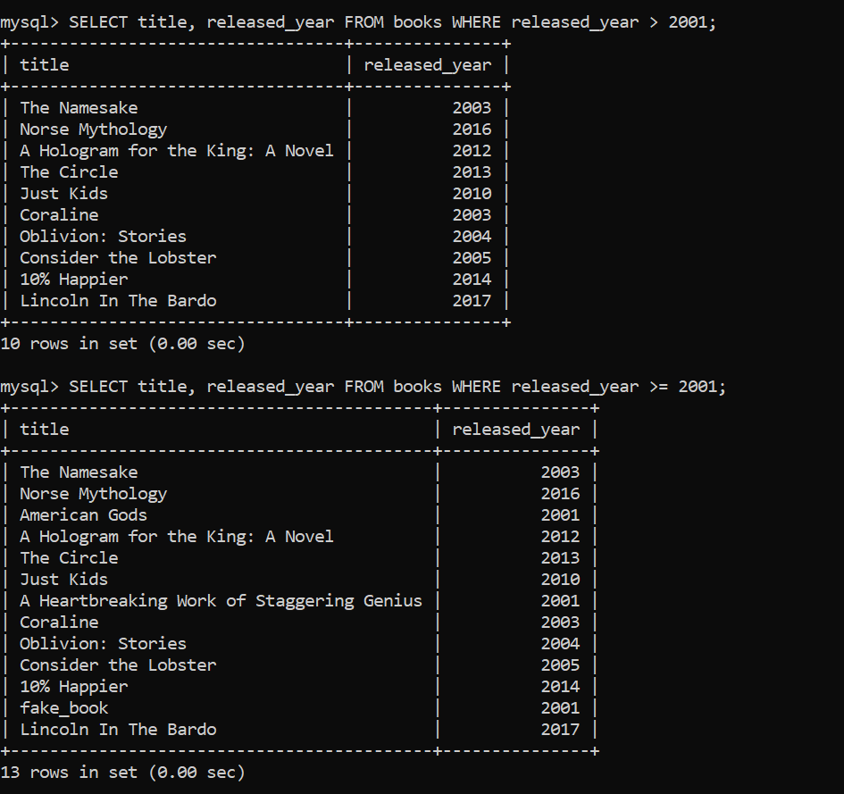
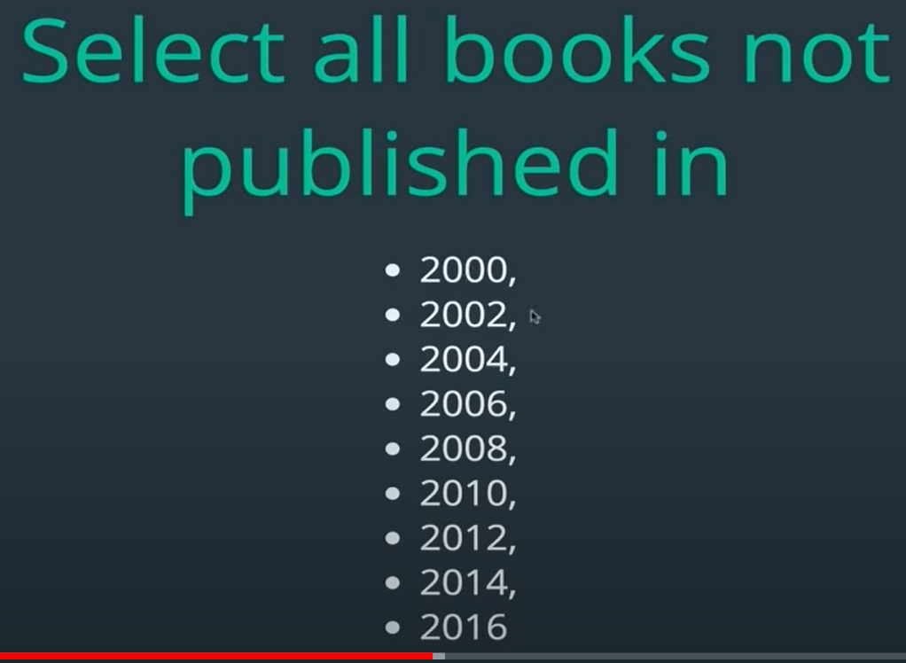

## Logical operators

until now, we selected/update/delete datas for eg: select data only whose color is red
But what if we want data whose
-color is red or blue,
-color is red and shape is circle.

For those sort of things and many other powerful stuffs we use logical operators

### != (not equal)

select books that were not released in 2017

select books that not written by author with lastname Harris

### LIKE

already learnt

### NOT LIKE

opposite of LIKE
gives that doesnot match specified pattern

books which title doesnot start with w:

### > (GREATER THAN), >=(Greater than or equal to), < (Less than), <= ( less than or equal to)

select books released after 2001:

you can see 2001 is included in >= but not in >
and similar for < and <=

order after filtering:

##### Booleans in mysql

booleans in mysql are stored and given as 1 and 0
1 => true
0 => false

eg:

BUT, string comparision using these operator can be tricky, (dont use it in string comparision as much as possible)

in alphabetical order, the alphabet that comes first is treated as smaller one:
eg: a is treated smaller than b
also, as we already learnt string in mysql is case insensitive to a = A;

eg:

so, under the hood when we used WHERE name = "abc"; it was comparing name="abc" and returing a boolean 1 or 0, and the rows for which it returned 1, where selected.

### && or AND (Logical And)

returns true only if all chained expression is true(1).
if any one of them is false, it return false(0)

can use && or can use AND , both does same thing

select books written by author eggers, published after the year 2010:

can be very useful for things such as finding products of a brand which are in stock,
find users of certian role but are active only, etc

can chain it multiple times.

### || or, OR (Logical OR)

returns true if any one expression is true(1).
if all of them is false, it return false(0)

so it gives data even if it that row satisfies one exp ie if atleast one exp is true.

eg:

### BETWEEN

USED to select data between a range.

syntax: BETWEEN x AND y
where range is from x to y (inclusive => includes x and y as well)
also this AND paired with BETWEEN is not logical and we studied before , it is different when paired with BETWEEN.

select all books published between 2004 and 2015:

Without using between:

Using between:

Difference is using we cant make between exclusive of range, but just by using > or < instead of >= or <= , we can include number of range as well.

### NOT BETWEEN

data that doesnot lies in a range.
opposite of BETWEEN.

#### Comparing dates and times

Until now we compared numbers and strings, but what about dates and times.

As we have already seen, dates and times can be inserted as string basically, but with proper format eg: "YYYY-MM-DD"

So, mysql recommends to use CAST() while comparing dates and times.

##### CAST()

to convert one data type to another in mysql.

comparing using plain date as string can work, but some times it may show unusual data so, to avoid it first convert the date string to date or datetime data type using cast then compare them:

here it works fine in both cases, but make sure to use CAST() to be in safe side.

### IN

can we used to give data by checking if it satisfies a set of exp ie if the column data is included in IN() sets.

WHERE a IN (x,y,z, and so on)

so gives true if a=x or a=y , or a=z and so on and gives data for row

can we used to short the logical OR to compare data using = , if we have to use multiple ORs:

OR,

also if we have to add other author name later , it easier using IN.

### NOT IN

opposite of IN
gives data if not included inside of NOT IN() set.

can we used to short the logical AND to compare data using != , if we have to use multiple ANDs:

 ie books published after 2000 and not even.

We just did it to use NOT IN. But it can be done in better way using modulo(%)

### CASE STATEMENTS (Conditional statements)

In programming language, we can do if a condition is met do one thing , else do another thing , we can so similar thing in sql using CASE STATEMENTS.

lets say, we want to print genre of book ,which will be "Modern Lit" if its released year is after 2000, else will be "20th Century Lit"

we can do it as:

As we can see title of column is very weird so use aliasing for it:

As we can see we are doing:
SELECT title , released_year FROM books;
but by appying condition to do(print) something(here genre)

Here , we can see:
WHEN is similar to if() or else if() or switch case to check condition
THEN is similar to return
ELSE is similar to else()
END infers to end of CASE STATEMENTS.

nOTE: HERE the case statement column (here genre), is not added in books table, it is only being printed out, (or can be used to update/delete something as well based on condition)
ie can combine with anything in mysql.

lets say we want to symbolize stock quantity: eg:
"\*" for small quantity(0 to 50)
"**" for medium quantity(50 to 100)
"\***" for large quantity(above 100)

also we can chain multiple case statements as per requirements:

for above solution, we can write condition little differently (above one is more understandable than this one)

This gives same result.
It is possible because sql applies query from left to right(or can say top to bottom), so when row is stisfied as first condition it never reaches 2nd condition ie it reaches 2nd condition only if 1st condition is not satisfied
