# Relationships and Joins

Until now, we only worked with an isolated table ie one table at a time. But in real world, tables are interrelated to each other.

Eg: One user can have multiple comments,ie user and comment table are related.

## Types of relationships

ONE TO ONE (1:1) is not much common. Some example of it can be user table and user Details table ie one userDetails table for one user, where we store auth related stuff in user table and other details in user detail table.

The most common is 1:MANY or MANY:1 (same).

And second most common is MANY:MANY.

### ONE TO MANY RELATIONSHIP

lets implement 1:MANY relationship for customers and orders (one customer can have multiple orders)

for customer we want to store:

for order we want to store:

For this we could use single table, But should we ??
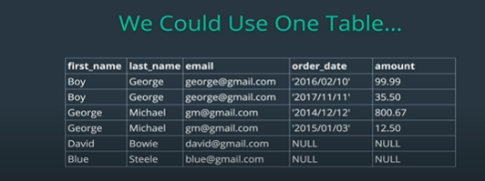
This is not a good idea because:
Here as we can see:

- Boy George and George Michael have placed 2 orders so, they are duplicated.
- David and Blue have not placed any order yet, so order_date and amount of order is NULL, which is misleading.
- also if we are working with customer data, it is better if it dont affect order data, and we can do it by isolating them to different tables.

SO use one to many relationship:
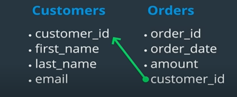
so orders table has a reference(here, customer_id) to customers table,so customer_id in orders table will correspond to actual customer of customers table.
customer_id of orders table is pointing customer_id of customers table.

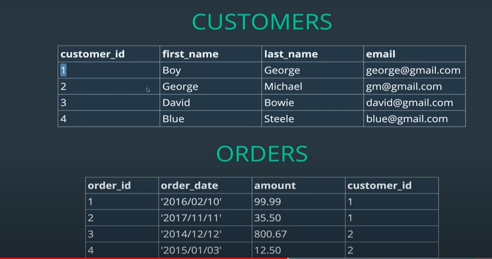

##### PRIMARY KEYS

unique value to indicate each row/data of a table,
customer_id is primary key of customers table.
order_id is primary key of orders table.
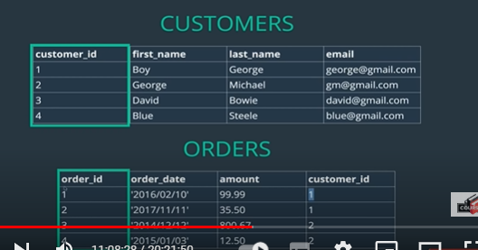

##### FOREIGN KEYS

reference key in a table to refer to another table
Here, customer_id in orders table is foreign key as it is refering to customer_id of customers table.
Usually, primary key of a table is used as foreign key for other table. (but we can use other column as well)
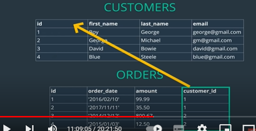
Here, customers table dont have any foreign key.

When making a scehma, we need to mention which one is foreign key as well. It is done so as to make sure, for eg: value used in foreign key actually exists in table it is referencing to: eg: If customer_id is 20 in orders table, but that customer dont exists in customer table, it cause problem of whose order is it.So to avoid it, foreign key should be used.

---- LETS GET STARTED NOW

First create a new database customers then , use it .

Then create customer table with id, first_name, last_name and email:

    CREATE TABLE customers
    (
    id INT PRIMARY KEY AUTO_INCREMENT,
    first_name VARCHAR(100),
    last_name VARCHAR(100),
    email VARCHAR(100)
    );

Insert some data in customers:

    INSERT INTO customers (first_name, last_name, email)
    VALUES ('Boy', 'George', 'george@gmail.com'),
    ('George', 'Michael', 'gm@gmail.com'),
    ('David', 'Bowie', 'david@gmail.com'),
    ('Blue', 'Steele', 'blue@gmail.com'),
    ('Bette', 'Davis', 'bette@aol.com');

Then create orders table with id, order_date, amount and customer_id:

    CREATE TABLE orders
    (
    id INT PRIMARY KEY AUTO_INCREMENT,
    order_date DATE,
    amount DECIMAL(8,2),
    customer_id INT,
    FOREIGN KEY(customer_id) REFERENCES customers(id)
    );

Here , dont forget to mention customer_id is foreign key.Here the last line
FOREIGN KEY(customer_id) REFERENCES customers(id)
is what does the job, FOREIGN KEY(customer_id) says customer_id is foreign key in this orders table referencing to the id of customers table: customers(id) => table_name(column_name_foreign_key_is_referencing)

See existing customer to insert customer_id while creating data for orders table:
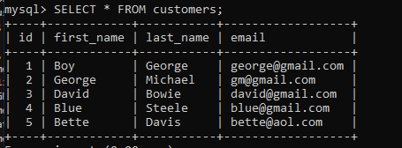

Insert data in orders table:

    INSERT INTO orders (order_date, amount, customer_id)
    VALUES ('2016/02/10', 99.99, 1),
    ('2017/11/11', 35.50, 1),
    ('2014/12/12', 800.67, 2),
    ('2015/01/03', 12.50, 2),
    ('1999/04/11', 450.25, 5);

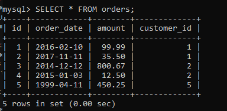

What if we try to use customer_id that dont exists?
Then Foreign key prevents it from happening:
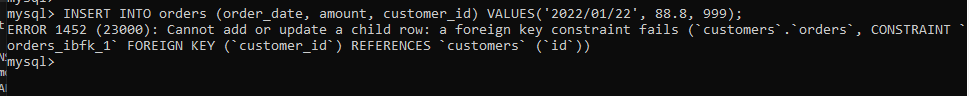

If we didnot use this line( FOREIGN KEY(customer_id) REFERENCES customers(id)) while creating orders table, we would have been able to insert any integer value ie customer id that dont even exists in customers table ie customers and orders table wont have any relation.

so, now we have established one to many relationship but have not worked with querying data out using this relation.

How to get the customer who ordered order 1?
Or, how to see all orders of a particular user ??, etc

For that we have to join tables.

### JOINS

lets say we want to get all the orders by customer named geroge as last name.
From the things learnt till now, we could do this in two steps.

first get id of customer with the last name george
then using that id of customer, get all orders using the foreign key customer_id in it:

    SELECT id FROM customers where last_name = "george";
    SELECT * FROM orders where customer_id = 1;

     Here, 1 is customer id we got from first query.

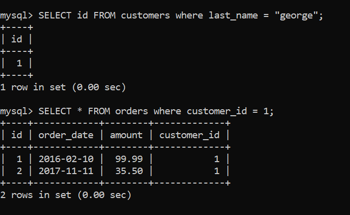
OR ,
Instead of this we can use subquery to pass id of customer with name george to do it using single query:

so instead of passing id of customer returned by first query manually, we will use first query in second query to do it:

    SELECT * FROM orders where customer_id = (
        SELECT id FROM customers where last_name = "george"
        );

But still, it only works if we want to show customer_id with orders, what if we want to show name of customer with each order to know who ordered it:

For that we need to use joins.

Implicit join => We dont explicitly say to join, mysql does it for us.

Lets see the most basic JOIN first.
This join is basically useless.

    SELECT * FROM customers, orders;

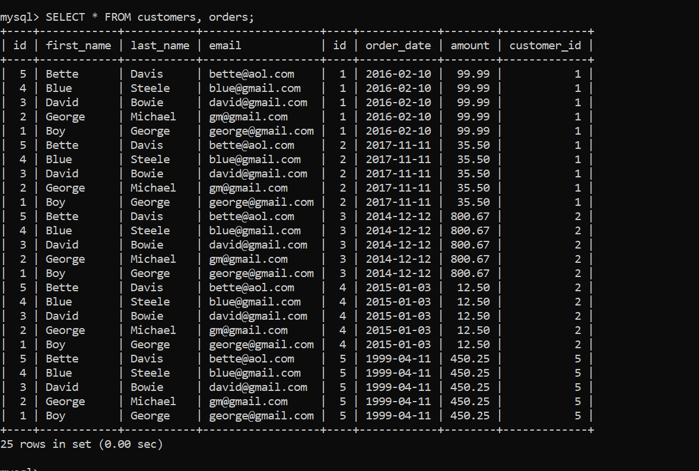

As we can see, it dont check any condition, it just joins each row of orders with each row of customers, basically it is like multiplying rows of two tables.

Also while joining order of table matters, if we used orders, customers then data of orders will show before customers.

### Inner join

so we check a condition in inner join, and only give data from tables satisfying that condition. so as we can see data given is like intersection from two sets/table, which mets join condition

### Implicit Inner join

    SELECT * FROM customers, orders
    WHERE customers.id = orders.customer_id;

    SELECT first_name, last_name, order_date, amount FROM customers, orders
    WHERE customers.id = orders.customer_id;

As we already saw in joined table above we have two id in joined table(one of customers and one of orders). So we need to do customers.id to be clear it is id column of customers table, customer_id is only one column in joined table so it is not necessary to do orders.customer_id we can simply do customers.id = customer_id, but still it is good practice to use orders.customer_id to be clear from which table does this column belong in the joined table.

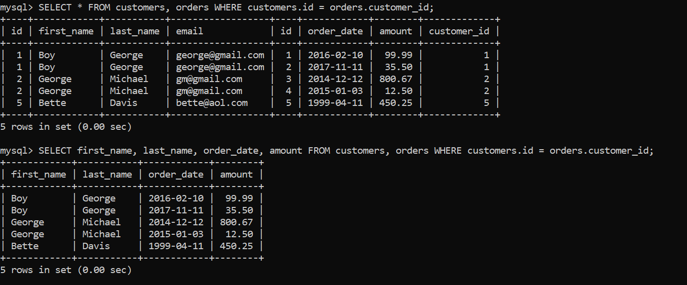

Still as we can see, order of table matters.

Usually, we use explicit join instead of implicit join, because it is more readable and understandable, even though both does same job of joining table.

### Explicit Inner join

Select a table , and join it with another table on meeting certain condition.

By default Joins are inner join so, we may or maynot mention INNER while doing inner joins.

    SELECT * FROM customers
    INNER JOIN orders
        ON customers.id = orders.customer_id;

OR,

    SELECT * FROM customers
    JOIN orders
        ON customers.id = orders.customer_id;

We can also select ,only required fields:

    SELECT first_name, last_name, order_date, amount FROM customers
    JOIN orders
        ON customers.id = orders.customer_id;

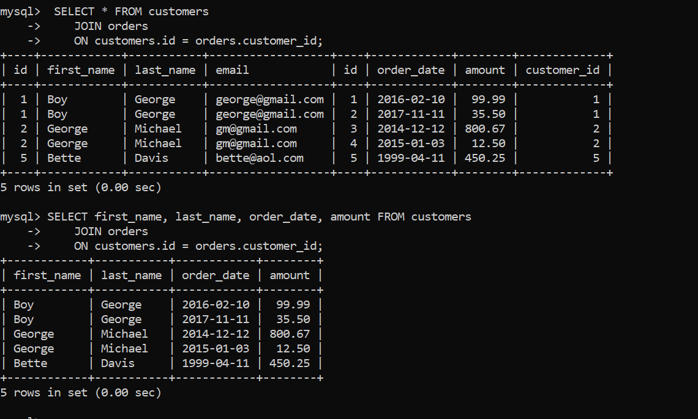

Still as we can see, order of table matters.If we do orders JOIN customers, it will display orders table data first.

    SELECT * FROM orders
    JOIN customers
        ON customers.id = orders.customer_id;

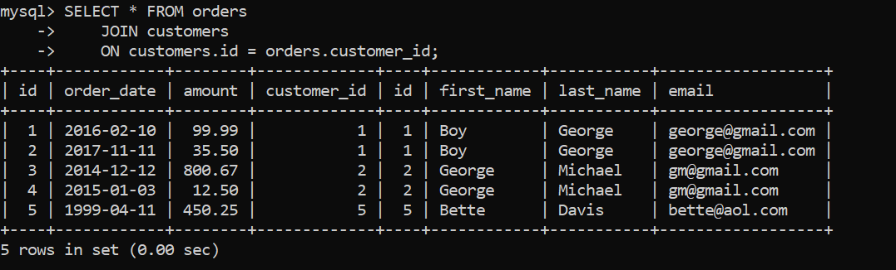

##### Note: While using inner join(implicit or explicit), usually we use foreign key of a table to compare with primary key of another (here,customer_id of orders with id of customers). But we can use arbitary condition as well which may not make any meaning eg: compare id of orders with id of customers, and still it wont give error: it will give data where id of order = id of customer.This is called arbitary join.

eg:
---- Arbitary Join (dont do this)
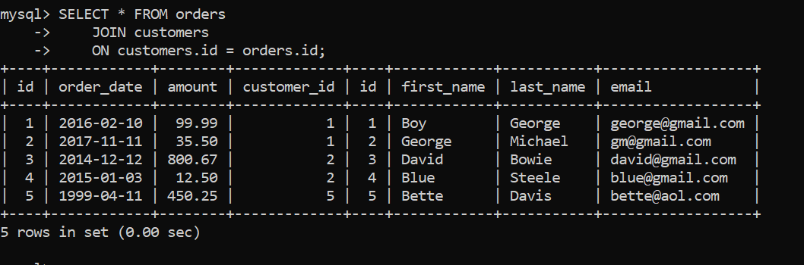

And we can use any sql function, or any cmd in joined table just like in normal table.

So lets find out the how much each customer have spent in orders:

For that we can group each customers' orders then sum the amount of grouped rows.

First lets check if functions like order_by is working or not:

    SELECT first_name, last_name, amount, order_date FROM customers
    JOIN orders
        ON customers.id = orders.customer_id
    ORDER BY order_date;

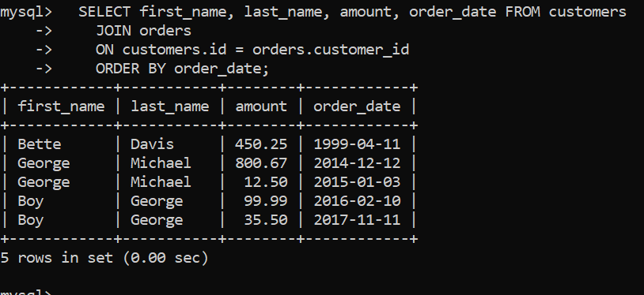

Group customers based on foreign key(customer_id):

NOTE: as already learnt displaying others columns other than column used to group is not possible in sql_mode=only_full_group_by.

    SELECT
        customer_id,
        first_name,
        last_name,
        amount
    FROM customers
    JOIN orders
        ON customers.id = orders.customer_id
    GROUP BY orders.customer_id;

Now instead of showing amount (here shows amount of first row from grouped mega rows.), show sum amount from megarows and display it(also lets order them before displaying):

        SELECT
        customer_id,
        first_name,
        last_name,
        SUM(amount) AS total_spent
    FROM customers
    JOIN orders
        ON customers.id = orders.customer_id
    GROUP BY orders.customer_id;
    ORDER BY total_spent DESC;

### Left Join

What if we want to check total amount of orders of each customer and if any customer have not made any order(ie amount is 0), then send them email, Here if we used inner join the customers who didnot made any order wont be seen, so we can use left join.

Here all data of left table is given but only the data that satisfies condition is given for right table.

Also order of table still matters here, customers LEFT JOIN orders so, customers is left table here.

    SELECT * FROM  customers
    LEFT JOIN orders
        ON customers.id = orders.customer_id;

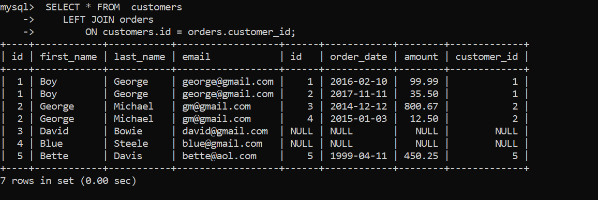

so all data of customers is given but for orders, if customer dont have order ie condition is not met, columns of orders table is filled with NULL data.

    SELECT
        first_name,
        last_name,
        order_date,
        amount
    FROM customers
    LEFT JOIN orders
        ON customers.id = orders.customer_id;

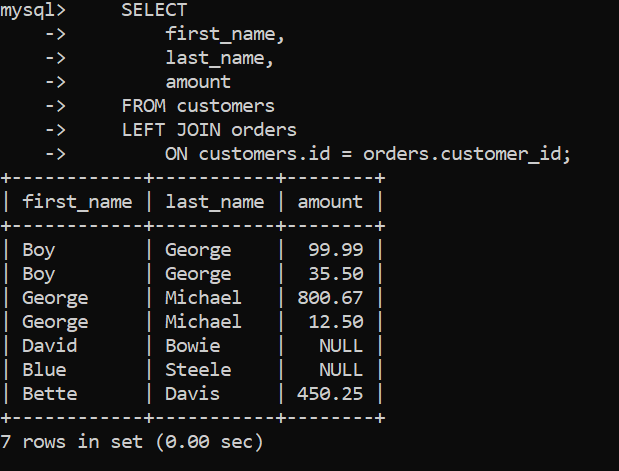

So now, just like before lets group customers, this time we can use customers.id ie id of customers table as it has all customers(id for each customer), then display the total amount for each customer using SUM

    SELECT
        first_name,
        last_name,
        order_date,
        SUM(amount) AS total_spent
    FROM customers
    LEFT JOIN orders
        ON customers.id = orders.customer_id
    GROUP BY customers.id;

But we see total spent for customer with no order is NULL,
To display 0 instead of NULL:
we can use CASE STATEMENT but we have better solution for this:

### IFNULL

this function checks if a value is NULL or not, and if it is null, it will replace with provided value(2nd argument)

syntax: IFNULL(value_to_check_if_it_is_NULL, value_to_replace_if_it_is_NULL)

     SELECT
        first_name,
        last_name,
        order_date,
        IFNULL(SUM(amount), 0) AS total_spent
    FROM customers
    LEFT JOIN orders
        ON customers.id = orders.customer_id
    GROUP BY customers.id
    ORDER BY total_spent;

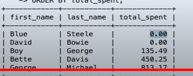

### Right Join

same left join but it is just the flipping/mirror of left join.

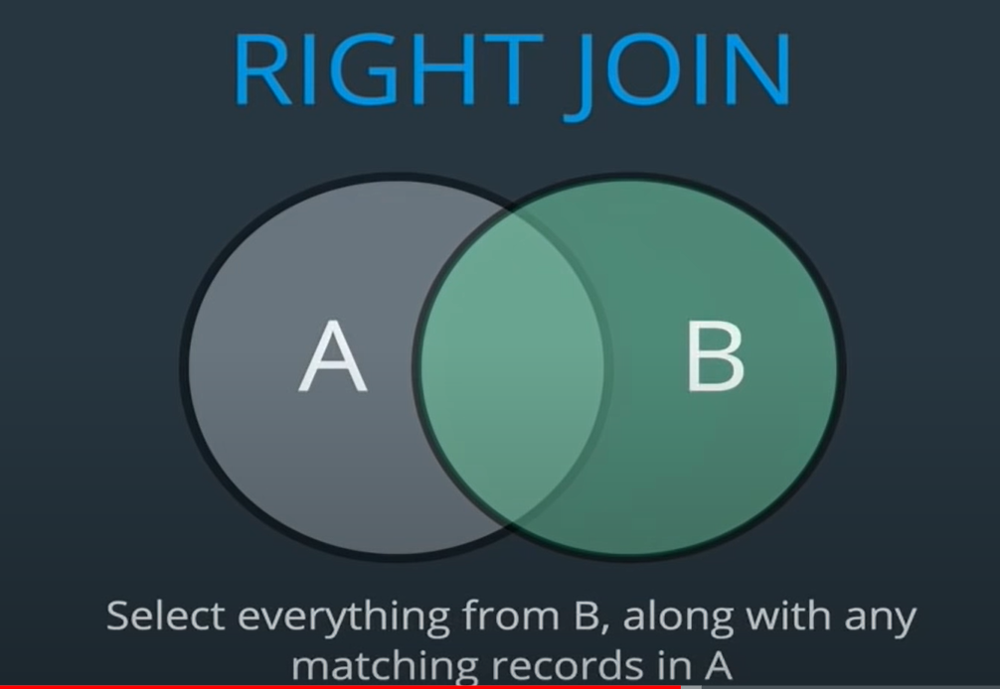

If we use customers has right table: we see same data as left join but customer data on right side:

    SELECT
        first_name,
        last_name,
        order_date,
        amount
    FROM orders
    RIGHT JOIN customers
        ON customers.id = orders.customer_id;

But if we do, customers as left and orders as right, then we see same as inner join.And same holds true for left join when order of tables are changed. It is because all orders table data is displayed, but since all customer dont have order, those customer are not given:

       SELECT
        first_name,
        last_name,
        order_date,
        amount
    FROM customers
    RIGHT JOIN orders
        ON customers.id = orders.customer_id;

What if some customers with orders are deleted, will it display NULL for those customers => Yes it will.

###### But practically, deleting customers is not possible due to foreign key constraint we used while creating orders table. And logically it is good, because if we want to delete a customer, first we need to delete all the orders ordered by that customer or when deleting customer, we also must delete all orders ordered by that customer otherwise whose order is it?. Similarly, if we want to delete whole customers table, we need to delete whole orders table first. ie, before deleting parent , we first need to delete all the dependents/childs:

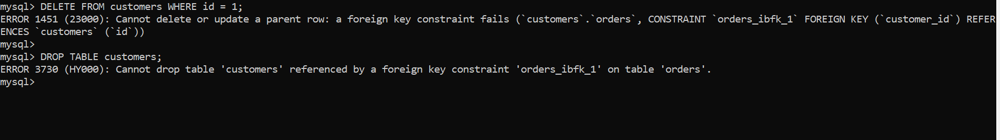

So to drop customers, first need to drop orders

    DROP TABLE orders;
    DROP TABLE customers;

    OR , in one line but ORDERS need to come first:

    DROP TABLE orders, customers;

### ON DELETE CASCADE

as we already learnt, we cant simply delete a customer until it has one or more order.But what we can do is use cascade delete ie when we delete a customer, also delete all orders of that customer on that customer delete automatically.

To achieve this, we just have to use ON DELETE CASCADE with foreign key constraint when creating child/dependent(here, orders) tables:

Create customers table:

    CREATE TABLE customers
    (
    id INT PRIMARY KEY AUTO_INCREMENT,
    first_name VARCHAR(100),
    last_name VARCHAR(100),
    email VARCHAR(100)
    );

Then create orders table with id, order_date, amount and customer_id:

    CREATE TABLE orders
    (
    id INT PRIMARY KEY AUTO_INCREMENT,
    order_date DATE,
    amount DECIMAL(8,2),
    customer_id INT,
    FOREIGN KEY(customer_id)
        REFERENCES customers(id)
        ON DELETE CASCADE
    );

Insert some data in customers:

    INSERT INTO customers (first_name, last_name, email)
    VALUES ('Boy', 'George', 'george@gmail.com'),
    ('George', 'Michael', 'gm@gmail.com'),
    ('David', 'Bowie', 'david@gmail.com'),
    ('Blue', 'Steele', 'blue@gmail.com'),
    ('Bette', 'Davis', 'bette@aol.com');

Now, cascade delete is enabled.

Insert data in orders table:

    INSERT INTO orders (order_date, amount, customer_id)
    VALUES ('2016/02/10', 99.99, 1),
    ('2017/11/11', 35.50, 1),
    ('2014/12/12', 800.67, 2),
    ('2015/01/03', 12.50, 2),
    ('1999/04/11', 450.25, 5);

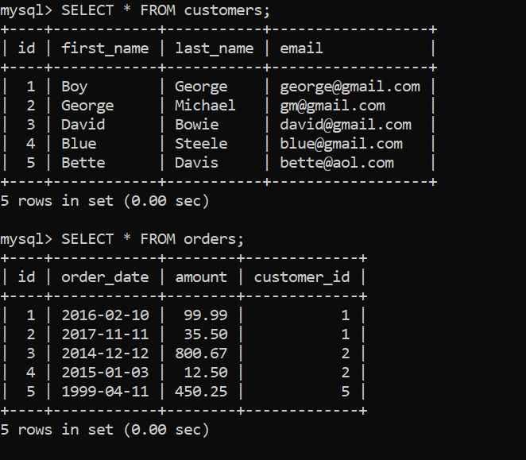

Now lets delete a customer and check:
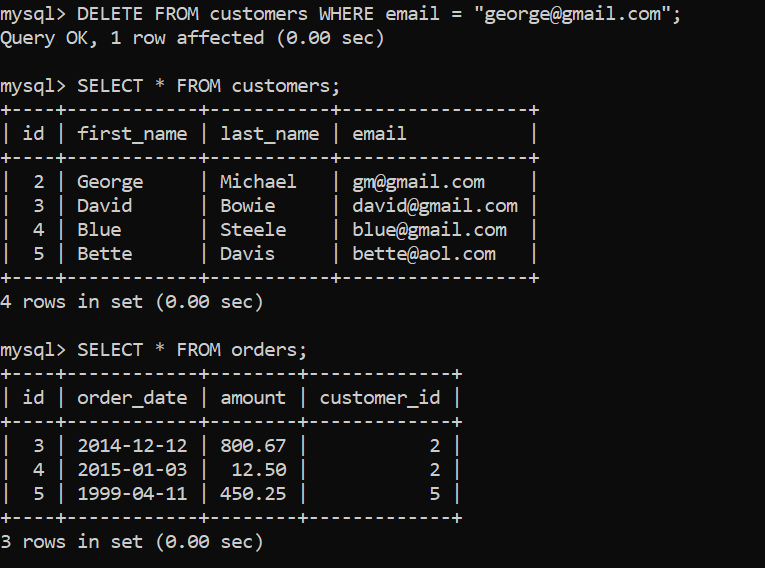
