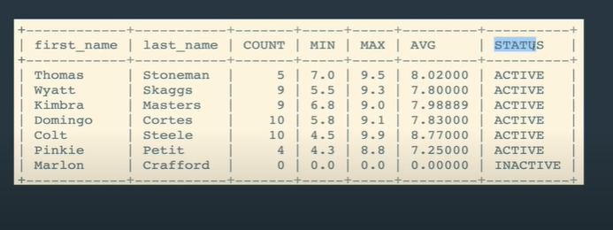

## Many to Many relationship

=> trickier than 1 to many.

eg: A book can be written by multiple authors. And an author can write multiple books.
So, books and authors have is many to many relationship.

In this tutorial, Image we're building a tv shows/series reviewing application.

A reviewer can review(rate) multiple series and a series can be rated by multiple reviewers.So they have many to many relationship. But, here they will have many:many with respect to reveiws table ie reviews provided by reviewer in series as follows:

As we can see above reviews table have series_id and reviewer_id as foreign keys to make relation between reviewers and series(indirectly through reviews table)

Here is an example of data in them:

Now lets put this in practice.

First lets create reviewers, series and reviews tables and insert some data in them.

For reviewers,

    CREATE TABLE reviewers
    (
        id INT AUTO_INCREMENT PRIMARY KEY,
        first_name VARCHAR(100),
        last_name VARCHAR(100)
    );

    INSERT INTO reviewers (first_name, last_name) VALUES
        ('Thomas', 'Stoneman'),
        ('Wyatt', 'Skaggs'),
        ('Kimbra', 'Masters'),
        ('Domingo', 'Cortes'),
        ('Colt', 'Steele'),
        ('Pinkie', 'Petit'),
        ('Marlon', 'Crafford');

For series,

Here we used data type Year(4) => 1999 instead of DATE => 1999-09-09, because we only want year. If we used int, we can enter invalied year as 8888, but Year(4) ensures it is valid year.(Year(2) => 99, 98.21 ie last 2 digits ie year in 2 digits)

    CREATE TABLE series
    (
        id INT AUTO_INCREMENT PRIMARY KEY,
        title VARCHAR(100),
        released_year YEAR(4),
        genre VARCHAR(100)
    );

    INSERT INTO series (title, released_year, genre) VALUES
        ('Archer', 2009, 'Animation'),
        ('Arrested Development', 2003, 'Comedy'),
        ("Bob's Burgers", 2011, 'Animation'),
        ('Bojack Horseman', 2014, 'Animation'),
        ("Breaking Bad", 2008, 'Drama'),
        ('Curb Your Enthusiasm', 2000, 'Comedy'),
        ("Fargo", 2014, 'Drama'),
        ('Freaks and Geeks', 1999, 'Comedy'),
        ('General Hospital', 1963, 'Drama'),
        ('Halt and Catch Fire', 2014, 'Drama'),
        ('Malcolm In The Middle', 2000, 'Comedy'),
        ('Pushing Daisies', 2007, 'Comedy'),
        ('Seinfeld', 1989, 'Comedy'),
        ('Stranger Things', 2016, 'Drama');

For reviews,

    CREATE TABLE reviews
    (
        id INT AUTO_INCREMENT PRIMARY KEY,
        rating DECIMAL(2,1),
        series_id INT,
        reviewer_id INT,
        FOREIGN KEY(series_id) REFERENCES series(id),
        FOREIGN KEY(reviewer_id) REFERENCES reviewers(id)
    );

    INSERT INTO reviews(series_id, reviewer_id, rating) VALUES
        (1,1,8.0),(1,2,7.5),(1,3,8.5),(1,4,7.7),(1,5,8.9),
        (2,1,8.1),(2,4,6.0),(2,3,8.0),(2,6,8.4),(2,5,9.9),
        (3,1,7.0),(3,6,7.5),(3,4,8.0),(3,3,7.1),(3,5,8.0),
        (4,1,7.5),(4,3,7.8),(4,4,8.3),(4,2,7.6),(4,5,8.5),
        (5,1,9.5),(5,3,9.0),(5,4,9.1),(5,2,9.3),(5,5,9.9),
        (6,2,6.5),(6,3,7.8),(6,4,8.8),(6,2,8.4),(6,5,9.1),
        (7,2,9.1),(7,5,9.7),
        (8,4,8.5),(8,2,7.8),(8,6,8.8),(8,5,9.3),
        (9,2,5.5),(9,3,6.8),(9,4,5.8),(9,6,4.3),(9,5,4.5),
        (10,5,9.9),
        (13,3,8.0),(13,4,7.2),
        (14,2,8.5),(14,3,8.9),(14,4,8.9);

then check the data:

    SELECT * FROM reviewers;
    SELECT * FROM series;
    SELECT * FROM reviews;

Now lets work with them.

Instead of jumping to working with 3 tables related tables at once, lets start by working with 2 table at a time, which we have already done in previous part.

##### Challenge 1

its easy when you first start by selecting datas from tables you want to join (work with) so:

    SELECT * FROM series;

    SELECT * FROM reviews;

Now lets join them and give required data:

    SELECT
        title,
        rating
    FROM series
    JOIN reviews
        ON series.id = reviews.series_id;

##### Challenge 2

    SELECT
        title,
        AVG(rating) as avg_rating
    FROM series
    JOIN reviews
        ON series.id = reviews.series_id
    GROUP BY series.id
    ORDER BY avg_rating;

##### Challenge 3

lets first select all data from two required tables reviewers and reviews.

Now:

    SELECT
        first_name,
        last_name,
        rating
    FROM reviewers
    JOIN reviews
        ON reviewers.id = reviews.reviewer_id;

##### Challenge 4

For it we need to know which tables do we need first.
Here we need series table to get series names or unreviewed series and we need reveiws table to know which series in reviewed or not.

Also we need to know which join to use.
Here if we use inner join, it will only give reviewed series(overlaped data from reviews and series tables) and ignore unreviewed series so we need to use left join or right join . Lets use left join then we will get NULL for unreviewed series. This way we know which series are not reviewed:

    SELECT
        title,
        rating
    FROM series
    LEFT JOIN reviews
        ON series.id = reviews.series_id;

now we just need to select the series with NULL rating:
For this we cant do WHERE rating = NULL, we need to do WHERE rating is NULL;
Because as we already learnt NULL in mysql is treated as data type rather than value.

        SELECT
            title AS unreviwed_series,
            rating
        FROM series
        LEFT JOIN reviews
            ON series.id = reviews.series_id
        WHERE rating IS NULL;

##### Challenge 5

    SELECT
         genre,
         AVG(rating) as avg_rating
    FROM series
    JOIN reviews
         ON series.id = reviews.series_id
    GROUP BY genre;

lets round up average rating to fixed 2 using ROUND() function.

syntax: ROUND(number_to_round, upto_which_decimal_place_to_round)

    SELECT
         genre,
         ROUND(AVG(rating), 2) as avg_rating
    FROM series
    JOIN reviews
         ON series.id = reviews.series_id
    GROUP BY genre;

##### Challenge 5

here, count is number of review/rating given by reviewer, min and max in minimum and maximum rating given by reviewer to a series, avg is avg of rating provided by reviewer, status is active for reviewer if he has provided atleast one rating otherwise its inactive.

    SELECT
        first_name,
        last_name,
        COUNT(rating) AS "COUNT",
        IFNULL(MIN(rating), 0) AS "MIN",
        IFNULL(MAX(rating), 0) AS "MAX",
        IFNULL(ROUND(AVG(rating), 2), 0) AS "MAX",
        CASE
            WHEN COUNT(rating) >=1 THEN "ACTIVE"
            ELSE "INACTIVE"
        END AS "STATUS"
    FROM reviewers
    LEFT JOIN reviews
        ON reviewers.id = reviews.reviewer_id
    GROUP BY reviewers.id;

Here we need to used COUNT of rating of each megarow grouped for each reviwer to decide if he is active or inactive,
We did it using CASE STATEMENT.
BUT for simple if else statement we can use IF() function as well

syntax: IF(condition, value_to_return_if_condition_is_true, value_to_return_if_condition_is_false)

    SELECT
        first_name,
        last_name,
        COUNT(rating) AS "COUNT",
        IFNULL(MIN(rating), 0) AS "MIN",
        IFNULL(MAX(rating), 0) AS "MAX",
        IFNULL(ROUND(AVG(rating), 2), 0) AS "MAX",
        IF(COUNT(rating) >=1, "ACTIVE", "INACTIVE" ) AS "STATUS"
    FROM reviewers
    LEFT JOIN reviews
        ON reviewers.id = reviews.reviewer_id
    GROUP BY reviewers.id;

This would give same result.

But for complex condition checking, like for more than one condition check,we need to use CASE STATEMENTS.

##### Challenge 6 -- JOIN 3 tables

It is very easy to join 3 tables in many:many when one table (here, reviews) is acting as bridge between other two (reviewers and series):

    SELECT
        title,
        rating,
        CONCAT(
            first_name,
            ' ',
            last_name
        ) AS reviewer
    FROM series
    INNER JOIN reviews
        ON series.id = reviews.series_id
    INNER JOIN reviewers
        ON reviewers.id = reviews.reviewer_id
    ORDER BY title;

