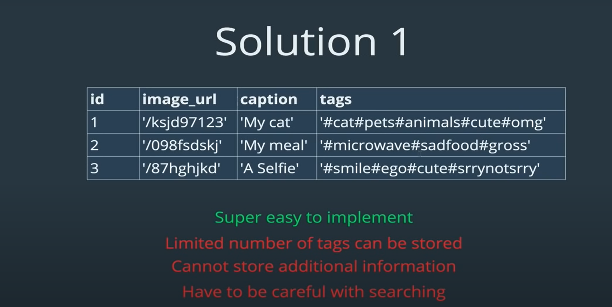
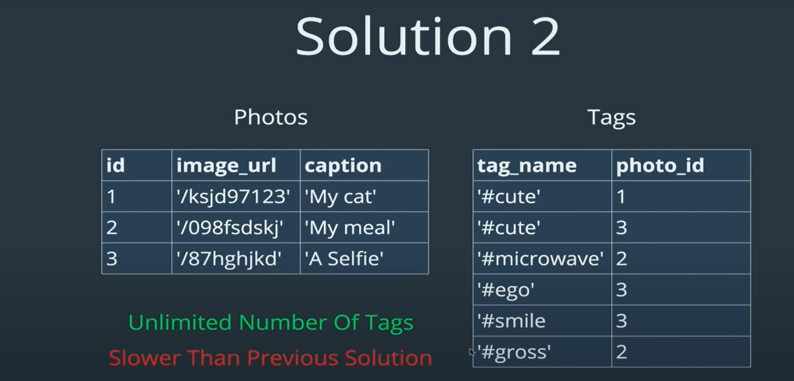
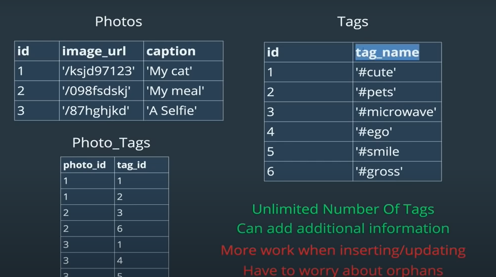
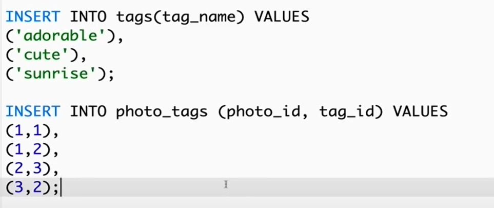

## SCHEMA DESIGN

#### LETS CLONE INSTRGRAM

table for photos (posted by user),
users,
likes (one user can only like once, will not implement unlike, need to code for that)
tags (multiple tags in one photo, same tag can be in multiple photos)

comments

followes and following (a user can only follow another user once)

First create schema/db:

    CREATE DATABASE ig_clone;
    USE ig_clone;

Users, as it is independent of other tables.

    CREATE TABLE users
    (
        id INT AUTO_INCREMENT PRIMARY KEY,
        username VARCHAR(255) UNIQUE NOT NULL,
        created_at TIMESTAMP DEFAULT NOW()
    );

Notice, how we use new thing: UNIQUE in username.
We learnt primary key is unique value that represents row, but what if we want other column data also to be unique like username/email, we cant make it primary key as well as we can only have one col as primary key , so we use UNIQUE to say it needs to be unique(no duplicates).

now lets see photos:
(which user posted photo)

    CREATE TABLE photos
    (
        id INT AUTO_INCREMENT PRIMARY KEY,
        image_url VARCHAR(255) NOT NULL,
        user_id INT NOT NULL,
        created_at TIMESTAMP DEFAULT NOW(),
        FOREIGN KEY(user_id) REFERENCES users(id)
    );

comments:
(which user commented and on which post is it commented)

    CREATE TABLE comments
    (
        id INT AUTO_INCREMENT PRIMARY KEY,
        comment_text VARCHAR(255) NOT NULL,
        user_id INT NOT NULL,
        photo_id INT NOT NULL,
        created_at TIMESTAMP DEFAULT NOW(),
        FOREIGN KEY(user_id) REFERENCES users(id),
        FOREIGN KEY(photo_id) REFERENCES photos(id)
    );

likes:
(which user liked, on which photo)

    CREATE TABLE likes
    (
        user_id INT NOT NULL,
        photo_id INT NOT NULL,
        created_at TIMESTAMP DEFAULT NOW(),
        FOREIGN KEY(user_id) REFERENCES users(id),
        FOREIGN KEY(photo_id) REFERENCES photos(id),
        PRIMARY KEY(user_id, photo_id)
    );

Here we dont have id for likes because we dont need to represent it anywhere.

Here one user can like same/one photo only once, so we used PRIMARY KEY(user_id, photo_id) => this does not mean user_id and phtot_id both are primary keys, this actually created one single value and treats it as primary key here: user_id-photo_id eg:
1-2, here user_id is 1 and photo_id is 2 so now the combination 1-2 is treated as primary key and it needs to be unique, hence 1-2 cant be repeated ie one user cant like same/one
Will use this in follows table as well.

follows:

Here we dont have id because we dont need to represent it anywhere.

here we will create one way relation ship,ie follower_id followed followee_id:

Here user(with id 3) followed user(with id 2)
Here user(with id 3) also followed user(with id 1)
Here user(with id 2) followed (back) user(with id 3)
But user (with id 1) is not following user(with id 3)

    CREATE TABLE follows
    (
        follower_id INT NOT NULL,
        followee_id INT NOT NULL,
        created_at TIMESTAMP DEFAULT NOW(),
        FOREIGN KEY(follower_id) REFERENCES users(id),
        FOREIGN KEY(followee_id) REFERENCES users(id),
        PRIMARY KEY(follower_id, followee_id)
    );

PRIMARY KEY(follower_id, followee_id) to ensure a user cant follow same user twice

tags:

lets see 3 solutions: will use solution 3:

solution 1: treat whole tags of a post as single sting:

solution 2:
each tag stored as a single row/data separately.

solution 3:
a separate table(photos_tags) to store relation between photos and tags

Here in photo_tags,
first row: photo(with id 1) have tag(with id 1)
second row: photo(with id 1) also have tag(with id 2)
third row: photo(with id 2) have tag(with id 1) and so on

orphans: eg : usually when we click on tag of a photo, we see all photos with that tag, but if that tag is deleted due to some restriction by instagram now, we cant click on tag of that photo ie that tag dont exist in database, so those tags are orphans

    CREATE TABLE tags
    (
        id INT AUTO_INCREMENT PRIMARY KEY,
        tag_name VARCHAR(255) UNIQUE,
        created_at TIMESTAMP DEFAULT NOW()
    );

    CREATE TABLE photo_tags
    (
        photo_id INT NOT NULL,
        tag_id INT NOT NULL,
        FOREIGN KEY(photo_id) REFERENCES photos(id),
        FOREIGN KEY(tag_id) REFERENCES tags(id),
        PRIMARY KEY(photo_id, tag_id)
    );

PRIMARY KEY(photo_id, tag_id) to unsure same photo cant have same tag more than once.

