run mysql/instagram/seed.sql file to seed the db first

open mysql shell in mqsql folder then:

    source ./instagram/seed.sql

Every challenge can have multiple solutions , here we will look one solution for each.

### Challenge 1

    SELECT * FROM users;

    SELECT
        *
    FROM users
    ORDER BY created_at DESC
    LIMIT 5;

### Challenge 2

    SELECT
        DAYNAME(created_at) AS day,
        COUNT(*) as total
    FROM users
    GROUP BY day
    ORDER BY total DESC
    LIMIT 1;

Remember here, count is giving the group user for each megarow not whole users table.

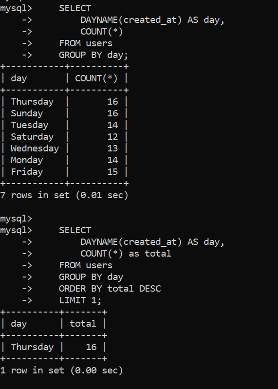

### Challenge 3

Fing inactive users.

    SELECT * FROM users;
    SELECT * FROM photos;

    SELECT
        username
    FROM users
    LEFT JOIN photos
        ON users.id = photos.user_id
    WHERE photos.id IS NULL;

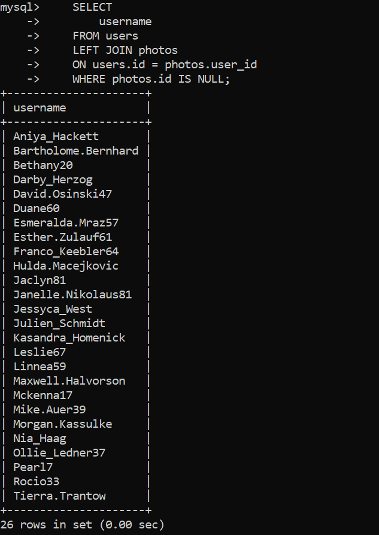

### Challenge 4

Identify most popular photo and user who posted id.

    SELECT * FROM users;
    SELECT * FROM likes;
    SELECT * FROM photos;

    SELECT
        photos.id,
        photos.image_url,
        likes.user_id
    FROM photos
    INNER JOIN likes
        ON photos.id = likes.photo_id
    GROUP BY photos.id;

    SELECT
        photos.id,
        photos.image_url,
        COUNT(*) AS total
    FROM photos
    INNER JOIN likes
        ON photos.id = likes.photo_id
    GROUP BY photos.id
    ORDER BY total DESC
    LIMIT 1;

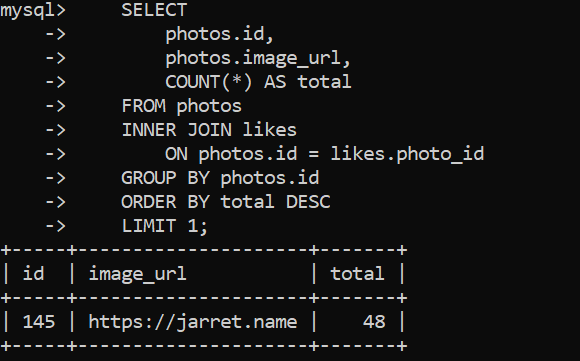

    SELECT
        photos.id,
        photos.image_url,
        COUNT(*) AS total
    FROM photos
    INNER JOIN likes
        ON photos.id = likes.photo_id
    INNER JOIN users
        ON photos.user_id = users.id
    GROUP BY photos.id
    ORDER BY total DESC
    LIMIT 1;

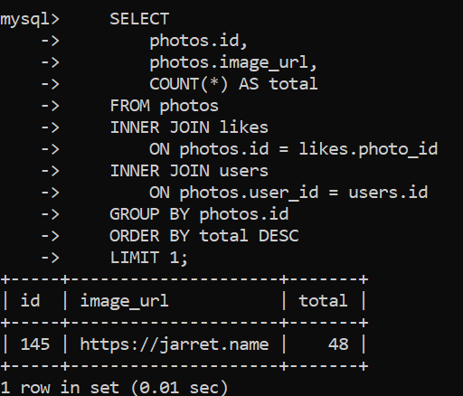

### Challenge 5

ans = total number of photots|posts / total number of users

    SELECT COUNT(*) FROM users;
    SELECT COUNT(*) FROM photos;

    SELECT 1/2;

    SELECT (SELECT COUNT(*) FROM photos) / (SELECT COUNT(*) FROM users);

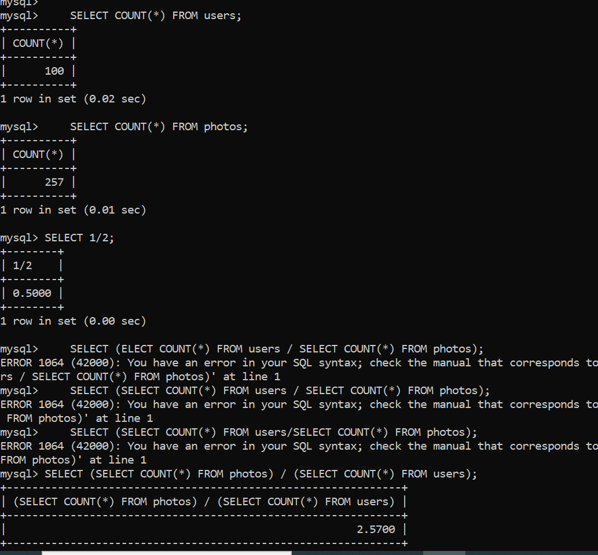

### Challenge 6

    SELECT * FROM tags;

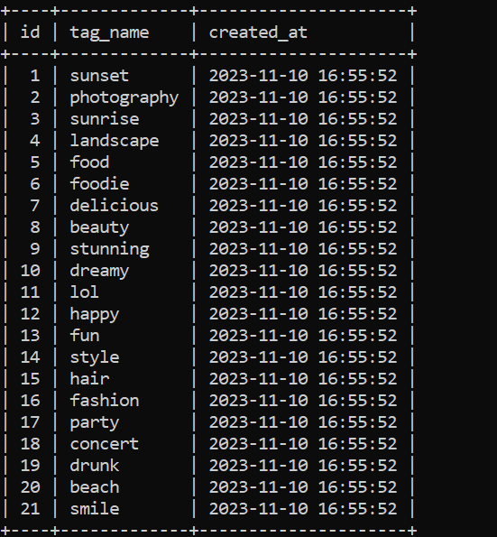

    SELECT * FROM photo_tags;

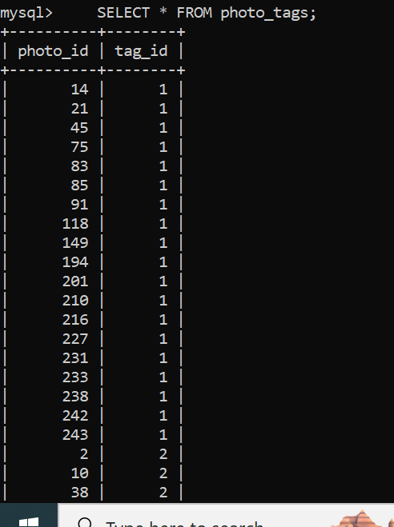

    SELECT
        tag_name
    FROM tags
    INNER JOIN photo_tags
        ON tags.id = photo_tags.tag_id;

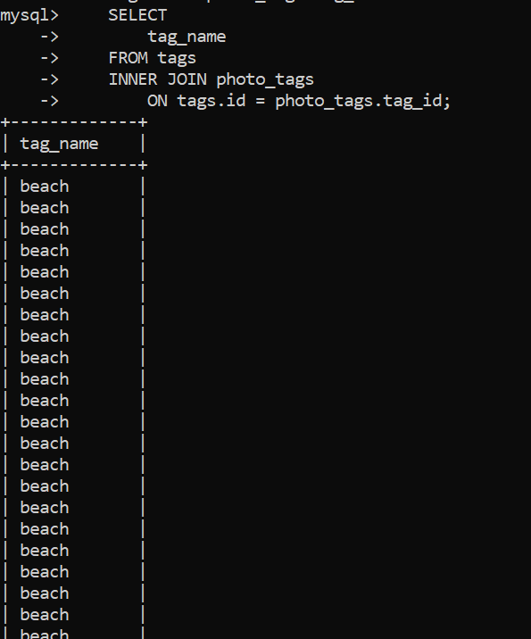

    SELECT
        tag_name,
        COUNT(*) as total
    FROM tags
    INNER JOIN photo_tags
        ON tags.id = photo_tags.tag_id
    GROUP BY tags.id;

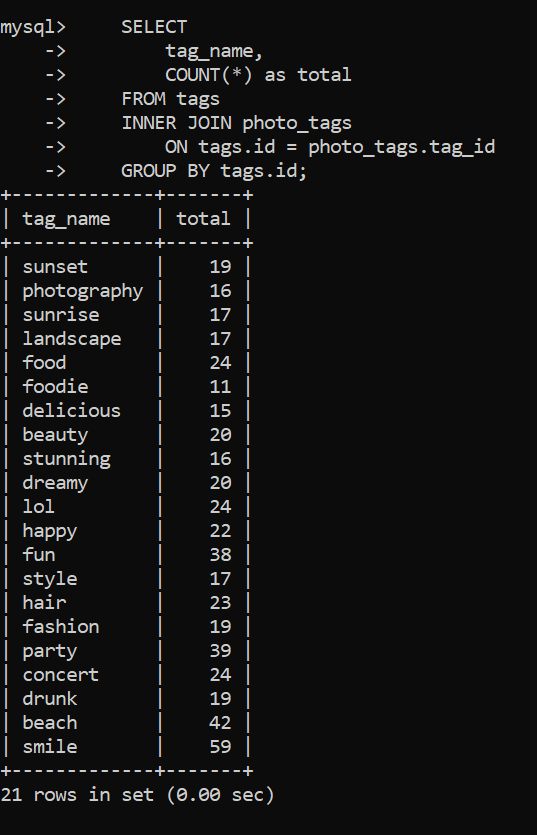

    SELECT
        tag_name,
        COUNT(*) as total
    FROM tags
    INNER JOIN photo_tags
        ON tags.id = photo_tags.tag_id
    GROUP BY tags.id
    ORDER BY total DESC
    LIMIT 5;

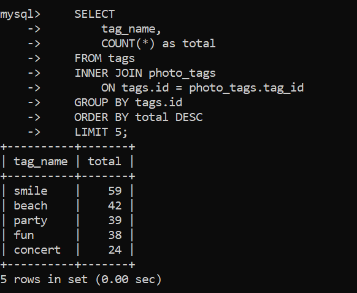

### Challenge 7

    SELECT COUNT(*) FROM photos;

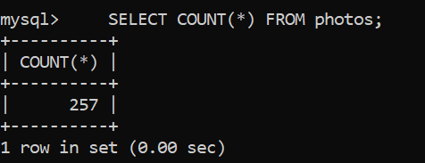
So we need to find users who have liked on all 257 photos.

    SELECT * FROM users;
    SELECT * FROM likes;

    SELECT
        users.username,
        user_id
    FROM users
    INNER JOIN likes
        ON users.id = likes.user_id
    GROUP BY likes.user_id;

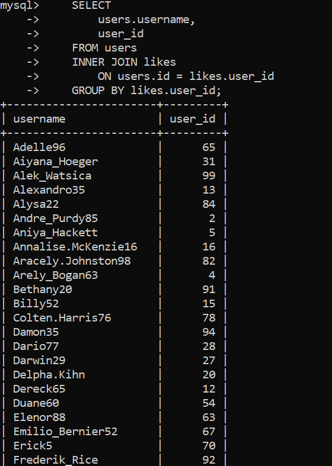

    SELECT
        users.username,
        COUNT(*) AS num_likes
    FROM users
    INNER JOIN likes
        ON users.id = likes.user_id
    GROUP BY likes.user_id;

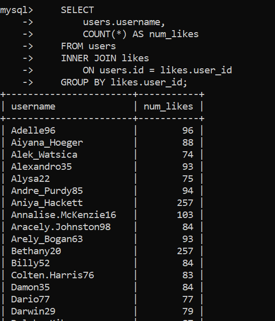

Now we got user and how may times they have liked (the photos), we need to get users who have liked all 257 photos:

    SELECT
        users.username,
        COUNT(*) AS num_likes
    FROM users
    INNER JOIN likes
        ON users.id = likes.user_id
    GROUP BY likes.user_id
    WHERE num_likes = 257;

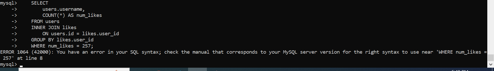

It is because we can only use WHERE to select datas before they are grouped , when they are grouped we cant use it to search among the grouped rows(ie we can only use WHERE before GROUP BY line,and not after that line)
for select among grouped rows, we need to use HAVING which does same job as WHERE for grouped rows.

    SELECT
        users.username,
        COUNT(*) AS num_likes
    FROM users
    INNER JOIN likes
        ON users.id = likes.user_id
    GROUP BY likes.user_id
    HAVING num_likes = 257;

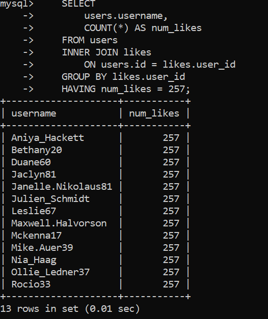

    SELECT
        users.username,
        COUNT(*) AS num_likes
    FROM users
    INNER JOIN likes
        ON users.id = likes.user_id
    GROUP BY likes.user_id
    HAVING num_likes = (SELECT COUNT(*) FROM photos);

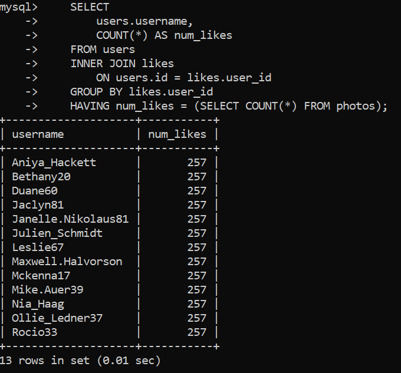
