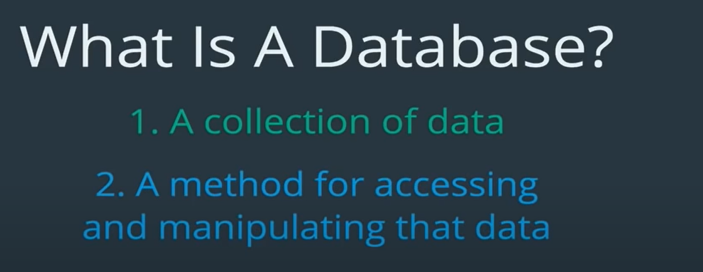

### Database

eg: phonebook

Here finding phone number of Ned Flanders would be easy for us, but not if we have to find phone number of all peope with name Ned, all people with first three same letters and so on.

- so for that database provides a bunch of methods for manipulatind data:
  

### Database vs Database Management system

Database is where we store data, dbms is interface to interact with data in database.Commonly, combined dbms + database is called database.So, basically mysql, postgres , oracle, etc are dbms actually , but are commonly called database.

### MySQL vs SQL

#### SQL => Structured Query Language

eg:
instead of human language, find all users we use sql language SELECT \* from users

As we can see in diagram below: both postgres and mysql use same sql language however, syntax may vary slightly.

### Installing MySQL

- Follow install mysql part of nest setup document to install mysql and see it if you face any problem.

#### Basics

We can run mySql commands on

1. Directly on mySql workbench.
2. on mySql interactive shell.
3. on your terminal by running `mysql -u root -p`
   Its initiate a connection of MySQL.

   -u means that we are going to connect with a username root. You can have different username set when installing and setting up mysql (other than root)

   -p means that we will enter username's password

### Basic mySql commands

0. mysql -u root -p
   enter password to open mysql cli on you terminal or you can do this on mysql command line client.

1. help;
   this will show list of commands we can use.

2. help contents;
   this will give list of different content of sql such as data types in sql, functions, etc

we can dive deeper as we go , like we can do:

3.  show data types;
    this will show list of data types used in sql.

        and we can go further deeper and so on for help;

4.  show databases;
    this will show list of database available on you mySql instance.

5.  select @@hostname;
    this will show name of host of you sql, most probably your desktop name,if you are running mySql locally.
