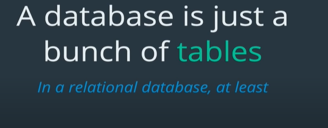
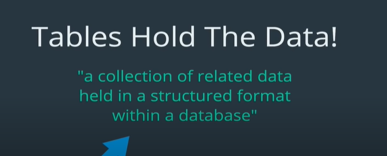
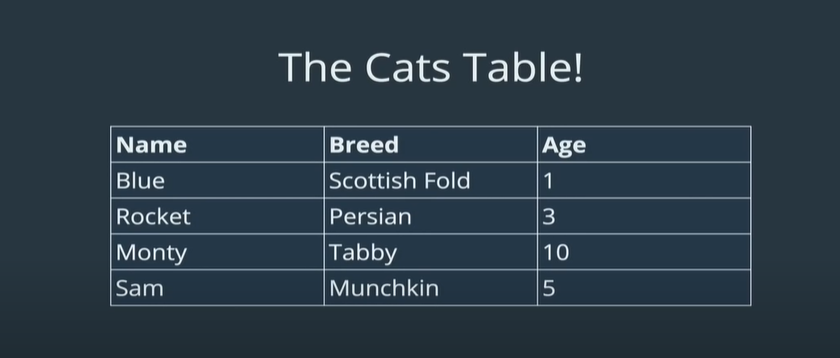
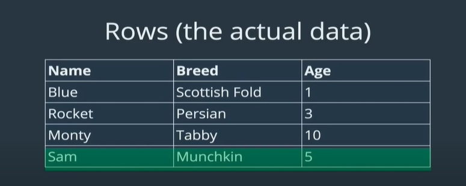
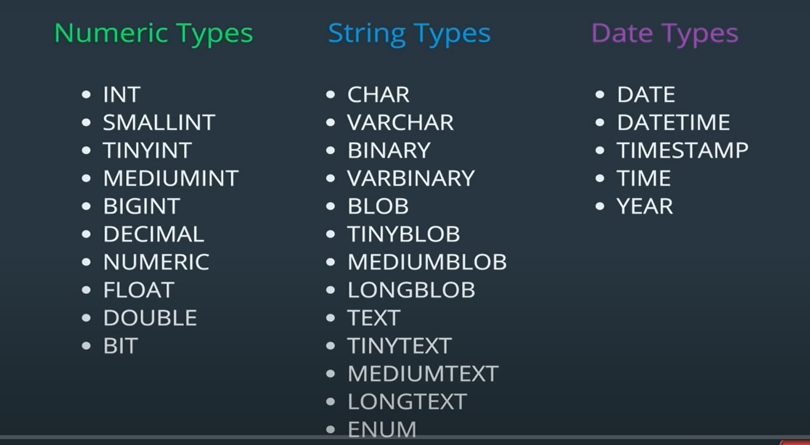
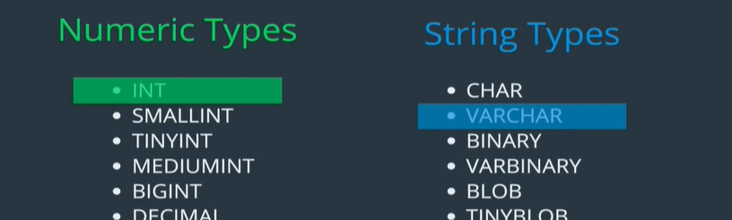
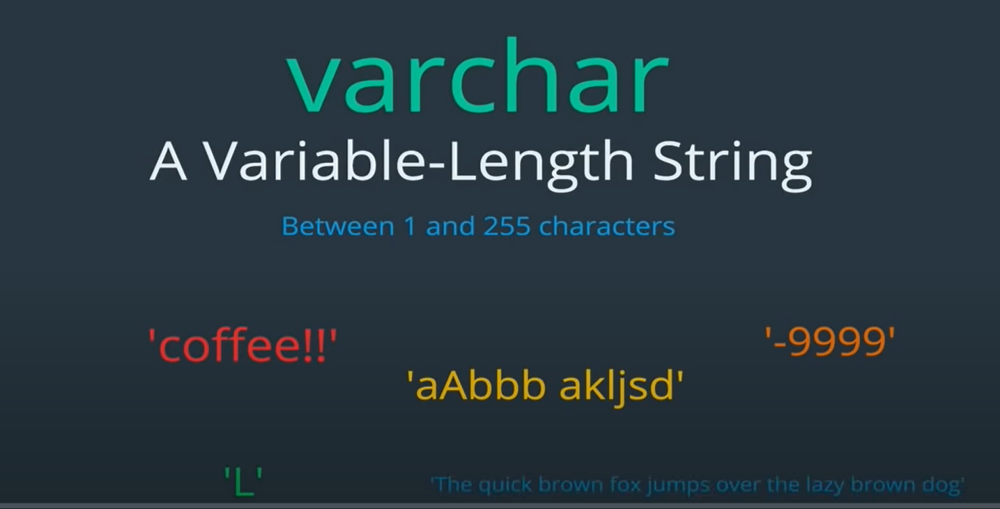
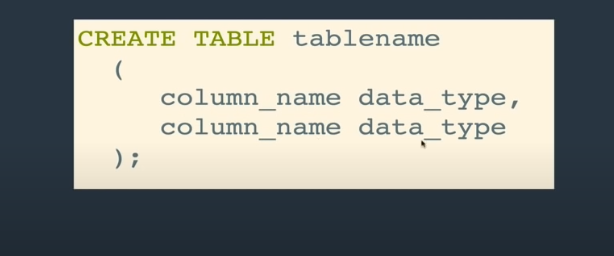

### Before starting: Good to know:

text uppercase or lowercase:

    It doesnot actually matter in terms of functionality. It is only for recognition of sql keywords and user provided names.

    eg: CREATE DATEBASE test_db;
    and: create database test_db;

    both will work fine.

naming convention in sql:

    1. testing_data
    2. testingData
    3. TestingData

    all works fine, but choose only one. (1) is better.

**but dont do: testing data, 12testing, etc**

semicolon(;)

    it signifies end of sql query.
    ie , if we dont use ; then it is not end of that query and we can use multiple commands in single query;

    eg:
    >> show databases  (enter without semicolon, will go to next cmd line but it is not ended)
    >> ; (in next line, semicolon is used means end of query command)

### Creating a database

Cmd:
show databases;

    shows list of database on our mysql server(here local server)

Cmd:
CREATE DATABASE <db_name>;

    this creates a db instance in our mysql server(here local)

eg:
CREATE DATABASE testing_db;

to check:
show databases;

    will include testing_db in the list of databases;

### Droping / Deleting a database

Cmd:
DROP DATABASE <db_name>;

    this creates a db instance in our mysql server(here local)

eg:
DROP DATABASE testing_db;

to check:
show databases;

now this will not have testing_db in the list of databases;

### Using Database

cmd: USE <db_name>;

    uses the database
    used to switch between different database (instance) available in our server;

eg:
show databases;
lets say we have testing_db

    USE testing_db;

    this will start using testing_db database;

cmd: SELECT database();
shows which database we are currently using.
if we are not using any databases, it show NULL

### Tables

Tables are hearts of sql.
In relational database,

eg:

Table Headers are columns.Tells the name of datas to store in table.

Rows are actual datas stored in tables.

#### Data Types (Tables part.2)

In SQL, we need to enforce data type for a column , for eg: for age column, we only need number and no text. Lets say we need to calculate sum of ages of all people, then it needs to be number for that.

There are alot of data types in sql. Some of them are:

Among them, most used ones are: int and varchar:

###### INT

###### varchar

eg: varchar(100)

    this will take upto 100 chars
    if string is longer than 100 chars, then it will only take first 100 chars of it.

#### Creating Tables (Tables part.3)

    the common naming covention to name a table is it should be in plural, because it is collection of data eg: cats

cmd:

    comma(,) is used to separate and declare the columns of table.

    you can do that in multiple lines or in single line:

    eg:
    >> CREATE TABLE cats (
    >> name VARCHAR(50),
    >> age INT
    >> );

    OR,

    >> CREATE TABLE cats (name VARCHAR(50), age INT);

#### Viewing Tables (Tables part.4)

cmd: SHOW TABLES;

    gives list of table in database instance you are currently using.

cmd: SHOW COLUMNS FROM <table_name>;
OR,
cmd: DESC <table_name>;

    this shows columns and data types in the table.
    it describes(DESC) table

#### Deleting/ Dropping Tables (Tables part.5)

cmd: DROP TABLE <table_name>;

    this deletes table permanently;

eg:

    >> DROP TABLE cats;
    deletes cats

    to check:
    >> SHOW TABLES;
    you wont see cats in list of tables as it is deleted.

    >> DESC cats;
    will give error as now cats table is deleted and it dont exist.
