### Inserting data in table

First make sure you are using database and have created a table in it.

cmd: INSERT INTO cats(name, age) VALUES("bibash", 23);

    Inserts a row of data in the table cats.
    You will see:1 Row affected ie one row of data is inserted.
    Order of column names and datas matters.
    Eg:
    You can use (age, names) instead of (name , age), but values also should be in exact order of column names.

Of course, you can do it in multiple lines instead of single line:
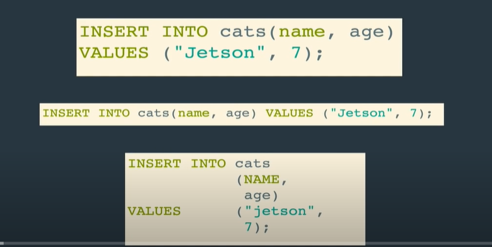

cmd: SELECT \* FROM cats;

    to check if it is inserted.
    gives all data in table.
    will learn about it later.

cmd: INSERT INTO cats(age, name) VALUES(21,"shyam"),(22, "hari"),(23, "laxman");

    inserts multiple rows of data at once.
    here, it will show: 3 rows inserted.
    again you can use :SELECT * FROM cats; to check if they are inserted.

And of course you can do it in multiple lines as well:
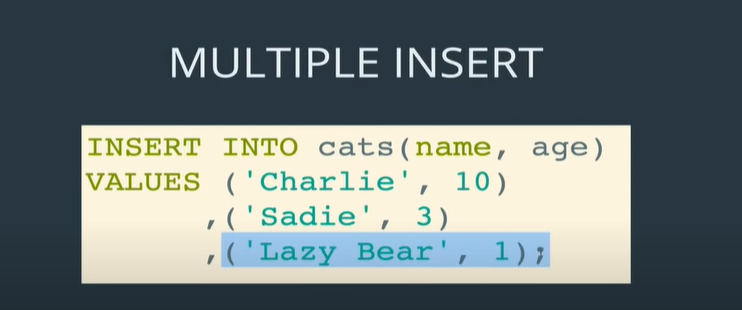

# Warnings in mysql

cmd: SHOW WARNINGS;

    shows warning for previous sql command used.

    eg:
    lets say we tried to insert long string for datatype of varchar(5)

    >> INSERT INTO cats(name, age) VALUES("lorem ipsum lorem ipsum lorem ipsum ipsum lorem ipsum lorem ipsum lorem ipsum lorem ipsum lorem ipsum lorem ipsum lorem ",20)

    here it will give: Query ok! 1 row affected! 1 warning

    Now to see that warining:
    >> SHOW WARNINGS;

    You will see warning: name has been truncated.
    Note: In newer version of sql, you might get error for above cmd instead of warning.

    But if after insert, you do:
    >> desc cats;
    then do:
    >> SHOW WARNINGS;
    this will not show warinig, as it only shows warining of prev command.

    Similary if we mix up data types, lets say string in int age:
    eg:
    >> INSERT INTO cats(name, age) VALUES("lorem ipsum lorem ipsum lorem ipsum ip", "kk");

    In lower version of mysql, you will get warining of incorrect datat ypes used while using >> SHOW WARININGS; and store a default value for that here , 0 for int (we can change this default value stored=> will study later)
    Note: In newer version, it will give error;

### NULL in mysql

NULL in mysql means the value is not known.
note: NULL doesnot mean value is 0.

cmd: desc cats;
we see:

Here we can see in above figure that NULL is YES for both columns ie it says both column name and age are nullable ie we can store nothing(NULL) in it.

    eg: lets say in table cates with columns name and age, we only insert name, then age will have NULL value now if it is nullable.
    >> INSERT INTO cats(name) VALUES("ajit");

    >> SELECT * FROM cats;
    You can see NULL in age with ajit as name.

    eg 2: if we insert a row without any data, then all nullable column will have NULL
    >> INSERT INTO cats() VALUES();

     >> SELECT * FROM cats;
    You can see NULL in both age and name in last row.

### NOT NULL in mysql

To prevent any column from being nullable, we use NOT NULL while creating table

eg: lets create table cats2 with columns name and age , both non nullable:

cmd: CREATE TABLE cats2(name VARCHAR(10) NOT NULL, age INT NOT NULL);

Now if you try to not provide value to non nullable column without default value, it shows as follows:
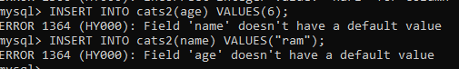

so we need to set default value when, column is non nullable.

### Default values in mysql

cmd: desc cats;
it gives: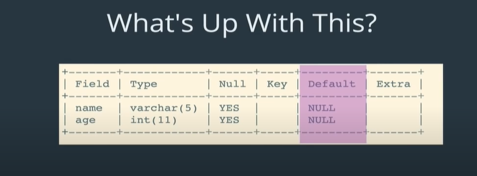
here default for both names and age is NULL means it dont have may default values.

Default values must match data types, eg: we can set string or empty string "" as default value to varchar(20) but cant set 0 as default value to it.

lets create table cats3 with both column name and age having default value.

cmd: CREATE TABLE cats3(name varchar(20) DEFAULT "name not provided", age INT DEFAULT 2

To check:
cmd: desc cats3;
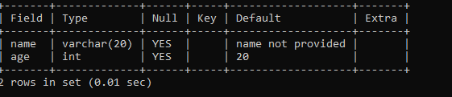
as we can see the default values set now for name and age column.

eg:

    if we only insert name, default value will be stored for age in cats 3 table.
    >> INSERT INTO cats3(name) VALUES("ram");
    >> SELECT * from cats3;

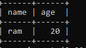
default value of age 20 is stored in age.

    >> INSERT INTO cats3() VALUES();
    >> SELECT * from cats3;

    name and age both will get the default value stored.

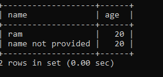

### Default values with NOT NULL in mysql

IS THIS REDUNDANT? BECAUSE IF WE PROVIDE DEFAULT VALUE THAT MEANS IT CANT BE NULL, ie it is NOT NULL automatically as it will always have value.

No that is not true, because we can insert NULL manually as well.IN such case, we need NOT NULL so as to provide error.

here we have default value set for name in cats3 table but it is still nullable so we can manually set its value to NULL as NOT NULL is not used for ir:

eg:

    >> INSERT INTO cats3(name) VALUES(NULL);
    >> SELECT * FROM cats3;
    we can see NULL is stored in cats3 name instead of default value "name not provided"

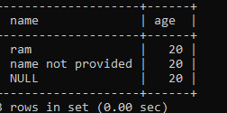

so to avoid this we need to use both NOT NULL and Default values:

lets create cats4 table and see it:

cmd: CREATE TABLE cats4(name varchar(20) NOT NULL DEFAULT "name not provided", age INT NOT NULL DEFAULT 20);

to check:
cmd: DESC cats4;
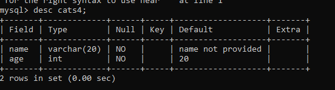

here, we can see both are not nullable and have default values.

So now even we by mistake or even manually try to set NULL in name or age it will give error.
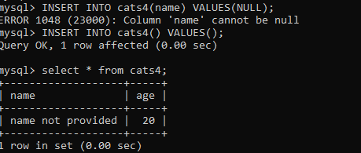

### PRIMARY KEY

> > DESC cats;
> > 

    key here, if that column is also a particular key in the table.

There are different types of keys in sql. Lets study about primary key.

We may have data/cat/row with same name and age. In such case how do we get or identify particular cat. For that we need a unique idenfier for each data/cat/row, known as primary key.

We can make any of the column a primary key, usually id is used. But we can also make email, username, or any other column a primary key. BUT, eventhough other column's data can have duplicate values, primary key column needs to be unique, it cannot store duplicate value.

lets create table cats5 with cat_id as primary key.
cmd:

cmd: CREATE TABLE cats5(cat_id INT,name VARCHAR(100), age INT, PRIMARY KEY(cat_id));

OR,

cmd: CREATE TABLE cats5(cat_id INT PRIMARY KEY,name VARCHAR(100), age INT);

to check:
cmd: DESC cats5;
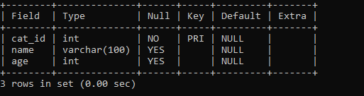
here we can see , cat_id is not primary key for cats5 table.

to see:
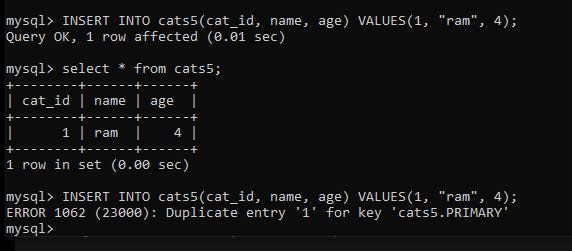

### AUTO_INCREMENT

instead of manullay inserting, primary key value we can use auto increment if it is INT.

cmd:

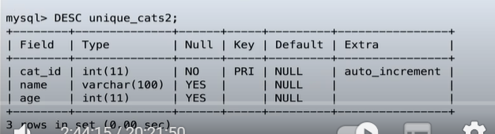

eg:

    >> CREATE TABLE cats6(cat_id INT NOT NULL AUTO_INCREMENT, name VARCHAR(10), age INT , PRIMARY KEY(cat_id));
    >> desc cats6;
    it gives:

    >> INSERT INTO cats6(name, age) VALUES("ram", 4);
    >> INSERT INTO cats6(name, age) VALUES("ram", 4);
    >> SELECT * FROM cats6;
    Now we can see, every thing can be duplicated but , primary key is auto incrementing and unique.

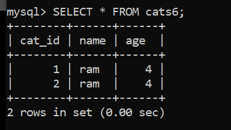
