## CRUD

### Create (INSERT INTO)

Already done it in previous section.

    First lets delete all existing tables:
    >> DROP TABLE cats, cats2 cats3, cats4, cats5, cats6, employee;

    Create a new table cats:
    >> CREATE TABLE cats(
    -> cat_id INT NOT NULL AUTO_INCREMENT,
    -> name VARCHAR(100),
    -> breed VARCHAR(100),
    -> age INT,
    -> PRIMARY KEY(cat_id)
    -> );

    Now create/insert data in it:
    >> INSERT INTO cats(name, breed, age)
    -> VALUES ("ram", "aaa", 5),
    -> ("hari", "bbb", 6),
    -> ("shyam", "aaa", 6);

### Read (SELECT)

    >> SELECT * from cats;
    This gives all columns in order they were created(ie, here cat_id, name, breed, age)

    We can also select particular column(s):
    >> SELECT name from cats;
    It gives all name column data of all cats;

    >> SELECT age from cats;
    It gives age column data of all cats;

    >> SELECT breed,age,name from cats;
    It gives breed, age and name column
    !!! ORDER MATERS => here it gives in order they are selected breed, age then name;

But This gives all data for selected column(s) .But what if we have 1000 cats it will give data of all cats, but we may want only cats with age below 4, all cats with name "age" and so on, That is where "WHERE" clause is used.

WHERE is used, not just for selecting , It is also used in updating(eg: update all cats with name "ram"), deleting(eg: delete cats of age below 5), etc

For now, lets use WHERE for selecting.

    >>  SELECT * FROM cats;

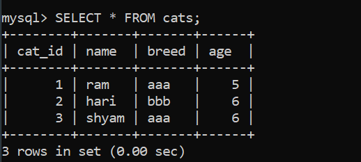

    >> SELECT * FROM cats WHERE age=6;

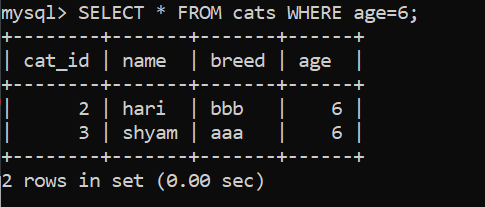

    In case of string, WHERE is CASE INSENSITIVE by default. We can make in case sensitive(will learn later). But case insensitive is fine for various cases such as email.
    >>  SELECT * FROM cats WHERE name="ram";
    >> SELECT * FROM cats WHERE name="RAM";
    >> SELECT * FROM cats WHERE name="raM";
    These all gives same result:

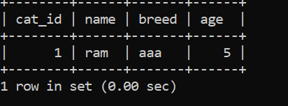

Nows lets combine them:

Select name and age of cats having breed of "aaa":

    >> SELECT name,age FROM cats WHERE breed="aaa";

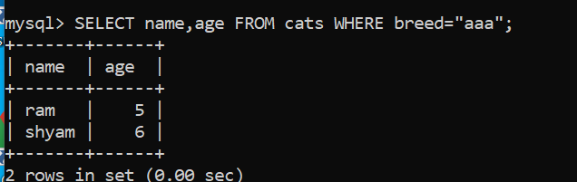

Find all cats with id same as their age:

    >> SELECT * FROM cats where cat_id=age;
    Since cat_id and age both are int type, mysql can do it.

#### Aliasing (AS)

lets say we joined two tables cats and dogs and both have name column so to get data from joined table we can rename column name as cat_name and dog_name to be clear using aliasing.

This wont alter the column or column name in table or their data, it will only provide us data by renaming it to us.

Eg:

    >> SELECT cat_id AS id from cats;
    We can see it in figure below, column cat_id is renamed as id.

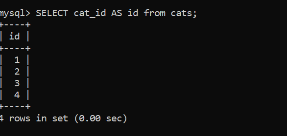

    We can also use string with whitespace while renaming:
    >> SELECT name AS cat_name, breed as "type of cat" from cats;

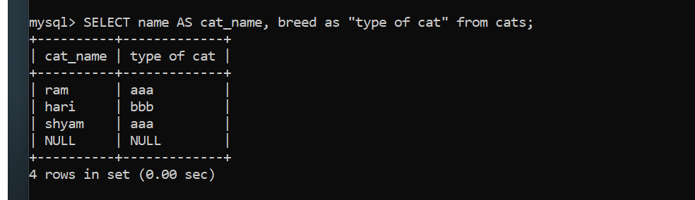

    >> DESC cats;
    As we can see column names are intact, they are not changed.

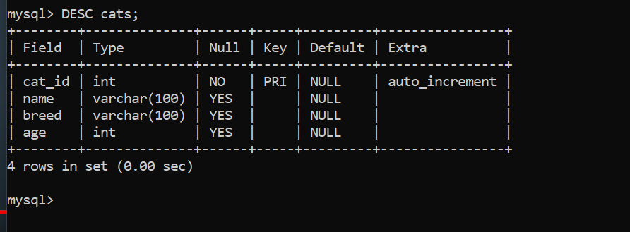

### Update (UPDATE - SET)

Alter/Change existing data

###### A good rule of thumb while updating and deleting: Always try SELECTing the data you want to update before updating.

Update all cats with breed of "aaa" and change their breed to "ccc":

    First try selecting data you want to update:
    >> SELECT * FROM cats WHERE breed="aaa";

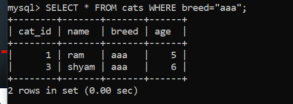

eg:

    Now update those cats' breed from "aaa" to "ccc":
    >> UPDATE cats SET breed="ccc" WHERE breed="aaa";
    Here UPDATE cats means update cats table data, SET breed="ccc" WHERE breed="aaa" means change all cats with breed "aaa" to breed "ccc".
    ( If you want to select whole table, you can skip WHERE clause:
    >> UPDATE cats SET breed="ccc";  )
    It will show: Rows matched: 2  Changed: 2  Warnings: 0

    To check if it is updated:
    >> SELECT * FROM cats;
    We can see all cats with breed "aaa" now has breed "ccc":

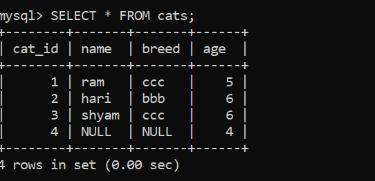

    update age of all cats whose name is "ram" to 14:
    >> UPDATE cats SET age=14 WHERE name="ram";
    >> SELECT * from cats WHERE name="ram";
    We can see ram has age of 14 now.

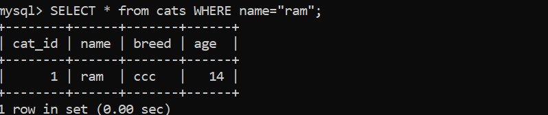

### DELETE (DELETE FROM)

###### A good rule of thumb while updating and deleting: Always try SELECTing the data you want to delete before deleting.

Eg:

    Delete a cat named "hari" from cats table:
    First try selecting that cat(s) you are about to delete:
    >> SELECT * FROM cats WHERE name = "hari";

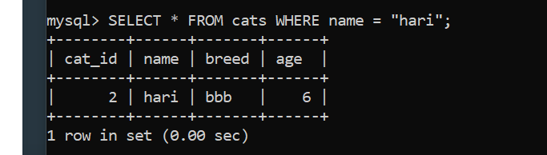

    >>  DELETE FROM cats WHERE name="hari";
    This will delete all cats named "hari" from cats table
    It will show: Query OK, 1 row affected (0.00 sec)

    To check:
    >> SELECT * FROM cats WHERE name = "hari";
    Will give: Empty sets ie no cats named hari ie they are deleted.
    Check again:
    >> SELECT * FROM cats;
    Will give table but no cat name hari is present as they are deleted.

    If you dont want to delete particular cats and apply delete on whole table:
    you can use:
    >> DELETE FROM cats;
    This will delete all data of cats table(this will not delete cats table itself, it will delete data inside of cats table.)

Exercise:

    Delete cats with age=4:
    >> DELETE FROM cats WHERE age=4;

    Delete cats with same id and age:
    >> DELETE FROM cats WHERE cat_id=age;

    Delete all cats:
    >> DELETE FROM cats;

    To check:
    >> SELECT * FROM cats;
    Will show : Empty sets (as all data is deleted)
