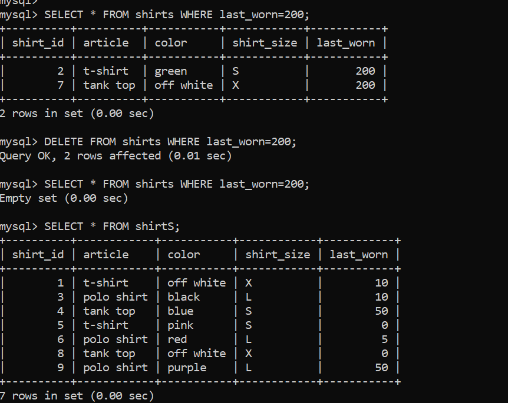
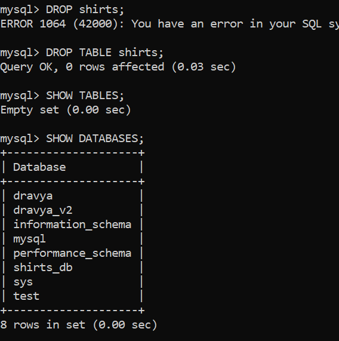

### CRUD Challange

Create a new database shirts_db and use it.

    Check existing databases:
    >> SHOW DATABASES;
    Create new database shirts_db:
    >> CREATE DATABASE shirts_db;
    Use shirts_db database:
    >> USE shirts_db;
    Check database being currently used:
    >> SELECT database();
    It will show shirts_db.

Create a new table shirts which looks like this:

here for shirt size variable name shirt_size is used instead of size because size is a reserved keyword in sql.

    >> CREATE TABLE shirts(shirt_id INT NOT NULL AUTO_INCREMENT PRIMARY KEY,article VARCHAR(50),color VARCHAR(50),shirt_size VARCHAR(1),last_worn INT);

    OR: you can use other syntax for primary key as:

    >> CREATE TABLE shirts(shirt_id INT NOT NULL AUTO_INCREMENT ,article VARCHAR(50),color VARCHAR(50),shirt_size VARCHAR(1),last_worn INT, PRIMARY KEY(shirt_id));

    To check:
    >> DESC shirts;

### CREATE

Insert these data to shirts table in format of article, color, shirt_size and last_worn:

    >> INSERT INTO shirts(article, color, shirt_size, last_worn) VALUES
    -> ("t-shirt","white", "S", 10),
    -> ("t-shirt","green", "S", 200),
    -> ("polo shirt","black", "M", 10),
    -> ("tank top","blue", "S", 50),
    -> ("t-shirt","pink", "S", 0),
    -> ("polo shirt","red", "M", 5),
    -> ("tank top","white", "S", 200),
    -> ("tank top","white", "S", 105);

    To check:
    >> SELECT * FROM shirts;

Last Task on Create:

    >> INSERT INTO shirts(article, color, shirt_size, last_worn) VALUES("polo shirt", "purple", "M", "50");

    TO check:
    >> SELECT * FROM shirts;

### READ

Task 1:

    >> SELECT article, color FROM shirts ;

Task 2:

    >> SELECT article,color,shirt_size,last_worn FROM shirts WHERE shirt_size="M";

#### UPDATE

Task 1:

    First select shirts you want to update:
    >> SELECT * FROM shirts WHERE article="polo shirt";

    Now update:
    >> UPDATE shirts SET shirt_size="L" WHERE article="polo shirt";

    Check:
    >> SELECT * FROM shirts WHERE article="polo shirt";

Task 2:
Update shirt of 105 days ago last_worn to 0 days ago:

    >> SELECT * FROM shirts WHERE  last_worn=105;

    >>  UPDATE shirts SET last_worn=0 WHERE last_worn=105;

    Check:
    >> SELECT * FROM shirts WHERE  last_worn=105;

    >> SELECT * FROM shirts;

Task 3:
Update all white shirts , Change size to "X" and color to "off white"

    >> SELECT * FROM shirts WHERE color="white";

    >> UPDATE shirts SET shirt_size="X", color="off white" WHERE color="white";

    Check:
    >> SELECT * FROM shirts;

### DELETE

Task 1: Delete all old shirts , last worn 200 days ago

    First try to select:
    >> SELECT * FROM shirts WHERE last_worn=200;

    Delete:
    >> DELETE FROM shirts WHERE last_worn=200;

    Check:
    >> SELECT * FROM shirts WHERE last_worn=200;
    >> SELECT * FROM shirts;

Task 2: Delete all tank

    First try to select:
    >>  SELECT * FROM shirts WHERE article="tank top";

    Delete:
    >> DELETE FROM shirts WHERE article="tank top";

    Check:
    >>  SELECT * FROM shirts WHERE article="tank top";
    >> SELECT * FROM shirts;

Task 3: Delete all shirts.

    >>  DELETE FROM shirts;

Task 4: Delete/ Drop shirts table

    >> DROP TABLE shirts;

    CHECK:
    >> SHOW TABLES;

