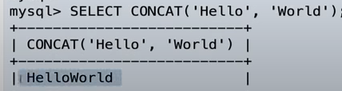
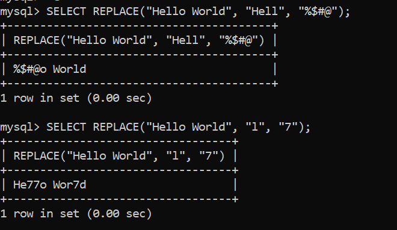
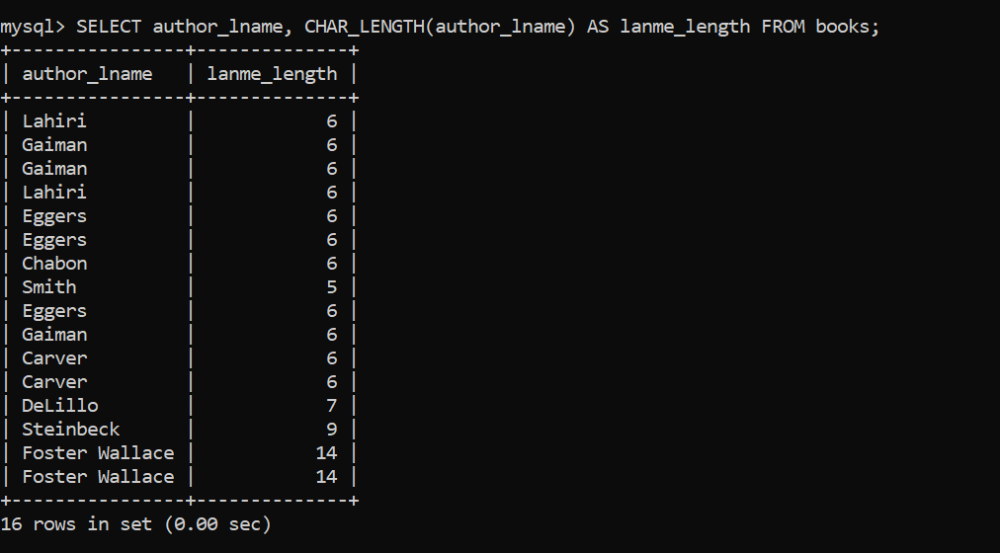

## Tip Before you start:

Until now you must have noticed : When you try to run multiline command on sql terminal, and if you make a mistake in a line, you cant go back to that line from current line.

So, its better to use .sql file to write sql command then use sql terminal to run it.

Eg:
Create a create.sql file and write command to create a table in it:

    CREATE TABLE cats
     (
     cat_id INT NOT NULL AUTO_INCREMENT,
     AGE INT,
     PRIMARY KEY(cat_id)
     );

To run this file , in terminal:

CMD: source <path_to_sql_file>

    First , (not in sql terminal, do it in other terminal like git bash, then open mysql cmd line using >> mysql -u root -p)
    >> ls
    to see the current directory and files.

    >> source create.sql

    If file is inside of testing folder:
    >> source testing/create.sql

    Check:
    >> DESC cats;

Similarly, you can use a different file for inserting datas to this table, and run it.

also, we can run mutiple cmds in a single file.eg: we can run create and insert and select in a single file and so on.

@@ If you are using sql workbench you can also write and sql commands there.

So,to start this course, first populate data using a sql file.

Create a folder mysql and open a terminal(git bash) on it,

inside mysql, create stringFunctions folder, and inside of it create, book-data.sql file and paste this sql cmds in it:

    USE book_shop;

    CREATE TABLE books
    (
    book_id INT NOT NULL AUTO_INCREMENT,
    title VARCHAR(100),
    author_fname VARCHAR(100),
    author_lname VARCHAR(100),
    released_year INT,
    stock_quantity INT,
    pages INT,
    PRIMARY KEY(book_id)
    );

    INSERT INTO books (title, author_fname, author_lname, released_year, stock_quantity, pages)
    VALUES
    ('The Namesake', 'Jhumpa', 'Lahiri', 2003, 32, 291),
    ('Norse Mythology', 'Neil', 'Gaiman',2016, 43, 304),
    ('American Gods', 'Neil', 'Gaiman', 2001, 12, 465),
    ('Interpreter of Maladies', 'Jhumpa', 'Lahiri', 1996, 97, 198),
    ('A Hologram for the King: A Novel', 'Dave', 'Eggers', 2012, 154, 352),
    ('The Circle', 'Dave', 'Eggers', 2013, 26, 504),
    ('The Amazing Adventures of Kavalier & Clay', 'Michael', 'Chabon', 2000, 68, 634),
    ('Just Kids', 'Patti', 'Smith', 2010, 55, 304),
    ('A Heartbreaking Work of Staggering Genius', 'Dave', 'Eggers', 2001, 104, 437),
    ('Coraline', 'Neil', 'Gaiman', 2003, 100, 208),
    ('What We Talk About When We Talk About Love: Stories', 'Raymond', 'Carver', 1981, 23, 176),
    ("Where I'm Calling From: Selected Stories", 'Raymond', 'Carver', 1989, 12, 526),
    ('White Noise', 'Don', 'DeLillo', 1985, 49, 320),
    ('Cannery Row', 'John', 'Steinbeck', 1945, 95, 181),
    ('Oblivion: Stories', 'David', 'Foster Wallace', 2004, 172, 329),
    ('Consider the Lobster', 'David', 'Foster Wallace', 2005, 92, 343);

Before running cmds of this file, first create a database:

    >> CREATE DATABASE book_shop;

Then run this file, this file will use book_shop db, create books table and populate data in that table:

    >> source ./stringFunctions/book-data.sql

Check:

    >> DESC books;
    >> SELECT * FROM books;

### String Functions

Until now we outputted data, as they were in table, we may need to add age and expense, concat firstname and last name ,remove some part of string, uppercase the string, etc before outputting them, for that we can use string functions.

If you search for:
mysql string functions

you will see:
https://dev.mysql.com/doc/refman/8.0/en/string-functions.html

Here you will find all string functions/methods you can use.

They dont affect tables data, they are only to display/output the data as you want them.

lets see some of them:

#### CONCAT()

Combine data for cleaner output

But here we can see , there is not space between fname and lname, for that we can add manual strings in it as:

so if you want full name:

But we can just use CONCAT() alone, we need to use it with SELECT (usually,to know from which table to perform the operation):

eg: lets combine author_fname and author_lname from books table to full name.

    First lets see the first name and last name of table:
    >> SELECT author_fname, author_lname from books;

    Concat them to full name:
    >> SELECT CONCAT(author_fname," ", author_lname) FROM books;

But as we can see column name as CONCAT, so we can alias/rename it as:

    >> SELECT CONCAT(author_fname," ", author_lname) as "full name" FROM books;

Also it is not compulsion to run string functions in isolation, you can run it with other commands such as read first name and last name, update, etc
eg:

    >> SELECT author_fname AS "first", author_lname as "last", CONCAT(author_fname," ", author_lname) AS "full" FROM books;

#### CONCAT_WS()

Here concat_ws means concat with separator, you can using any string as separator as first argument, then other columns as other arguments.

eg: if we want a string of title , fname and lname separated with " - " string:

then we can use :concat or concat_ws as follows:

using concat:

    >> SELECT CONCAT(title, " - ", author_fname, " - ", author_lname) from books;

using concat_ws:

    >> SELECT CONCAT_WS(" - ", title, author_fname, author_lname) from books;

Also remember, if you use columnName inside "" in concat , concat_ws it will be taken as string:
eg:

#### SUBSTRING()

work with parts of string eg: only first character of string, some characters from middle part of string, last character of string , etc

syntax:
SUBSTRING(string/column, starting_index, ending_index_optional)

##### but in mysql, string index starts with 1 , not 0;

It is similar to slice() array method, but ending_index is also included in substring()

examples:

    >>  SELECT SUBSTRING("Hello World", 1);
    gives Hello World

    >> SELECT SUBSTRING("Hello World", 2);
    gives ello World

    >> SELECT SUBSTRING("Hello World", 1, 4);
    gives Hell

-ve number means, start from end of string, ie -1 is last character of string.
Also, while using -ve number as 2nd arg, 3rd arg is not end_index, instead it is Number of characters.

    >> SELECT SUBSTRING("Hello World", -1);
    gives d

    >> SELECT SUBSTRING("Hello World", -5);
    gives World

    >> SELECT SUBSTRING("Hello World", 1, -5);
    gives empty string. Since, -ve number cant be used in 3rd arg.

    >> SELECT SUBSTRING("Hello World", -5, 3);
    gives Wor

Now lets do this with book's title:

    First view titles:
    >> SELECT title FROM books;

    lets only outout, first 10 characters of title:
    >> SELECT SUBSTRING(title, 1 , 10) FROM books;

    lets alias:
    >> SELECT SUBSTRING(title, 1 , 10) AS "short title" FROM books;

###### SUBSTR() can also be used instead of SUBSTRING() => does same thing, its short form:

    >> SELECT SUBSTR(title, 1 , 10) AS "short title" FROM books;

Just like other string functions, it is also not isolated, ie we can use it with other string functions(like, concat(), etc) and other sql commandss like(update(SET),etc)

lets see example to use it with concat:

    >> SELECT CONCAT( SUBSTRING(title, 1 , 10), "...") AS "short title" FROM books;

#### REPLACE()

replace parts of strings or whole string.

syntax:

REPLACE(string_to_manipulate, part_of_string_you_want_to_replace, string_you_want_to_replace_it_with)

examples:

NOTE: it is CASE SENSITIVE

Here we can see only small o is replaced with 8;

now lets do it with title of books:

also can combine it with other functions:
here lets only print first 10 letter of title after replace e in each title with 3;

#### REVERSE()

pretty straightforward => it reverses the string.

syntax:

REVERSE(string_to_reverse);

examples:

make palindrome of a string:

do same things with author_fname of books table:

#### CHAR_LENGTH()

pretty straightforward => it gives length the string.

syntax:

CHAR_LENGTH(string);

examples:

Print in this format: Eagers is 6 character long. where Eagers is author_lname and 6 is its length.

#### UPPER() and LOWER()

UPPER()=> change string to uppercase
LOWER()=> change string to lowercase

syntax:

UPPER(string);
LOWER(string);

examples:

