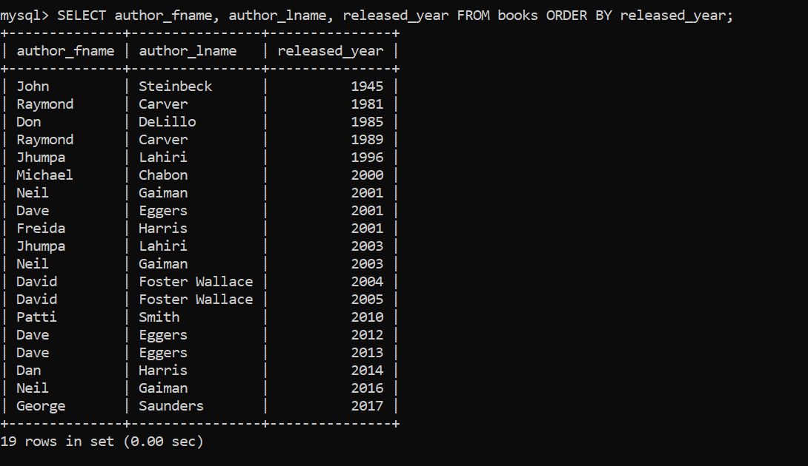

#### DINTINCT (for unique/no-duplicates)

Syntax: SELECT DISTINCT \* FROM books;

=> Use DISTINCT before SELECT

Befire starting, add some data to books table:

mysql> INSERT INTO books
-> (title, author_fname, author_lname, released_year, stock_quantity, pages)
-> VALUES ('10% Happier', 'Dan', 'Harris', 2014, 29, 256),
-> ('fake_book', 'Freida', 'Harris', 2001, 287, 428),
-> ('Lincoln In The Bardo', 'George', 'Saunders', 2017, 1000, 367);
Query OK, 3 rows affected (0.03 sec)

Check:

Now lets: get all unique author last names:

First get all names:

Now only uniques last names:

GET only unique released year:

To check, first get all years:

GEt only unique years:

We got uniques last names, but multiple author can have different first name but same last name and vice versa, so what if you have to get uniques full names:

(lets do it in distincts.sql file inside of refiningSelects inside of mysql folder:(to run open git bash inside mysql folder then in sql shell do: source ./refiningSelects/distincts.sql))

Method 1:Using concat but it will combine fname and lname to same string

Method 2:

    >> SELECT DISTINCT author_fname, author_lname FROM books;

As we can see, DISTINCT is applied to all selected columns as a whole row: ie only unique rows(will be considered same row, if values in all selected columns is same)

#### ORDER BY (sorting our results)

=> sorts the selected data.
=> By default, sorts in ascending order.

syntax: SELECT \* FROM table_name ORDER BY column_name;

can sort the string

can sort number

can sort alpha numeric as well(string + number combined)

to order in descending order, use DESC

By default gives in ascending, but can also mention it explicitly as ASC

Not a compulsion to select only the sorted column, can select other data sorted based on certain column:

We even may not select the sorted column but read other data sorted according to that sorted column:

Instead of writing same column_name in both select and order_by we can use index(in which coumns are selected starting from 1) to not repeat name in sql cmd:

Here 2 means author_lname

We can also sort using multiple columns but here it works differently. First it sorts with author_lname(first column in order_by) then instead of redoing ie sorting the table again with author_fname it only sorts the rows without affecting already sorted author_lname eg: here for Harris lname , Dan and Freida fname are sorted but the whole column fname is not sorted.

### LIMIT

=> tells how may rows(data) so we want our query to apply on.
=> usullay used at end of sql cmd

syntax: LIMIT number_to_limit;
LIMIT starting_index, number_to_limit(how_many); => for rows index starts with 0 (unlike string which start with 1) in sql.

eg: LIMIT 10 gives first 10 roww of selected data;

can even select whole table and limit it;

read title and released year of the first five most recently book:

Notice how we used limit at last so that it gives the sorted result, as we dont want to limit the unsorted first 5 books then sort them.

We can paginate using LIMIT as here: first we provide from which index data should be provided then we give how may data should be provided.

In sql if you want to select data from a index to all remaining data, we can used large number as to provide how many we can limit:

### LIKE

We used WHERE for searching/selecting but we can combine LIKE with WHERE for better searching.

Basics to use LIKE:
search with LIKE is CASE INSENSITIVE: da, Da , DA, aD all does same thing .
works on string, int , alphanumeric, and others as well.
search string is "da" => string "da" exactly
% => wildcard (anything)
%da% => anything that includes da
%da => anthing ending with da
da% => anything starting with da
_ => single character(can we single string character, a number , etc)
to include % and _ in search string, we use "\" as: \% , \_

select all titles and first name of author of all books whose author first name includes da:

select all titles and first name of author of all books whose author first name starts with da:

select all titles of all books whose author title is exactly "the":

select all titles of all books whose author title includes "the":

select all titles and stock_quantity of all books whose stock quantity has 2 digits":

select all titles and stock_quantity of all books whose stock quantity has 4 digits":

\_ is usually useful while searching data with certain pattern like:
phone number of pattern (977)9856-9999 can be searched with "(**\_)\_\_**-\_\_\_\_"

using only % to search will give all data:

select title that include % character:

select title that include \_ character:

### Exercise

1. print out title and pages of longest book(ie book with most pages)
   
