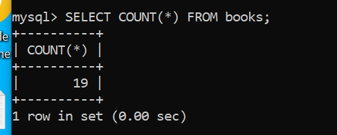
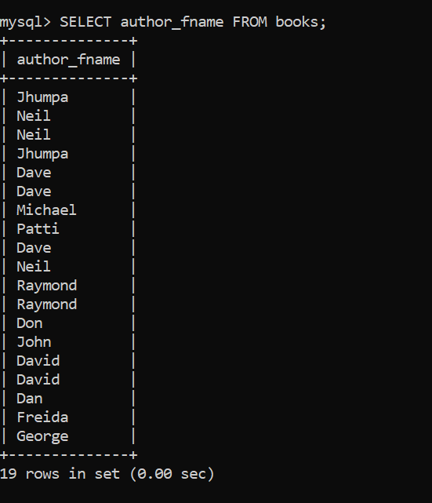
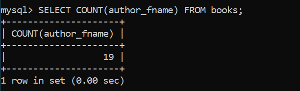
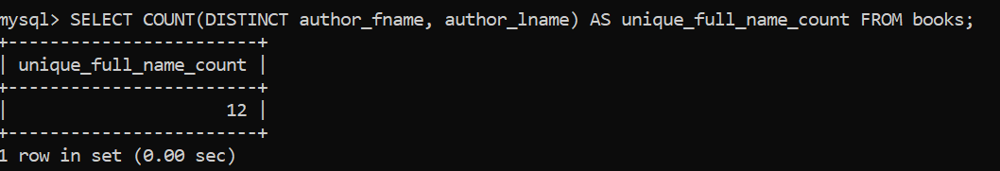
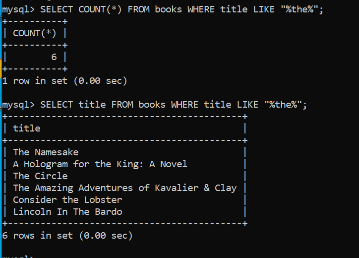
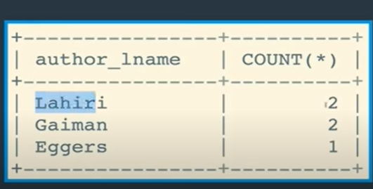

## Aggregate functions

prebuilt functions in sql which under the hood which can group the datas, and can we used to do various things such as count the data, find aggregate/mean of data, find the most liked posts, find most trending posts(group all posts with #caption, count the most use #caption, find the post with most used #caption), find minimum, maximum etc

Some of them are:

### COUNT

=> to give how many data.

how may book in a books table:

can also count single column data:
count how many author(author_fname):

first check all author_fname:

as we can see it also counts duplicate values:
so if we want to count uniques values only, we can combine it with DISTINCT :

of course we can combine it with anything:

give count of books whose title contains "the":

### GROUP_BY

It aggregates or summarizes identical data into single rows.

lets assume we have books table with title and author_lname data as this:

now lets group them with author_lname:

IT looks like it is giving the unique last names and the first title for that last name:But it is doing different thing under the hood:

It is grouping rows with same lname into a single row(megarow or grouped row) even though it only display first row data from that mega row to us.

So only grouping and reading data is typically not useful,but we can use count , and other func (will study later) as min, max to get counts, average ,etc

eg:

count number of books each author has written:

6:28
