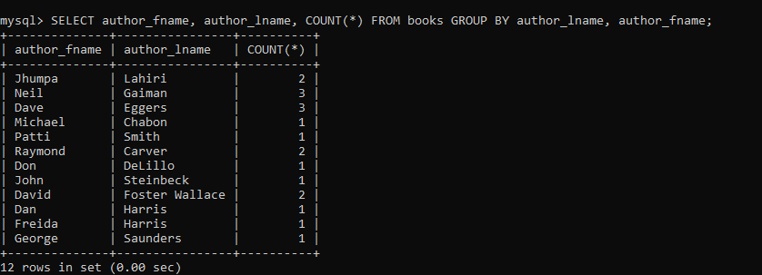
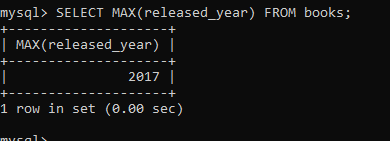

## Aggregate functions

prebuilt functions in sql which under the hood which can group the datas, and can we used to do various things such as count the data, find aggregate/mean of data, find the most liked posts, find most trending posts(group all posts with #caption, count the most use #caption, find the post with most used #caption), find minimum, maximum etc

Some of them are:

### COUNT

=> to give how many data.

how may book in a books table:

can also count single column data:
count how many author(author_fname):

first check all author_fname:

as we can see it also counts duplicate values:
so if we want to count uniques values only, we can combine it with DISTINCT :

of course we can combine it with anything:

give count of books whose title contains "the":

### GROUP_BY

It aggregates or summarizes identical data into single rows.

lets assume we have books table with title and author_lname data as this:

now lets group them with author_lname:

IT looks like it is giving the unique last names and the first title for that last name:But it is doing different thing under the hood:

It is grouping rows with same lname into a single row(megarow or grouped row) even though it only display first row data from that mega row to us.

So only grouping and reading data is typically not useful,but we can use count , and other func (will study later) as min, max to get counts, average ,etc

eg:

count number of books each author has written:

Here COUNT(\*) is referring to grouped rows, ie not all rows of table individually.

###### Note: In latest mysql versions, default sql mode is ONLY_FULL_GROUP_BY, which means you can only select grouped column along with functions such as count but cant select other columns with it.To see the default modes: >> SHOW VARIABLES LIKE 'sql_mode'; (Also you can disable this mode: >> set global sql_mode=''; but its not recommended). To again enable it:>> set global sql_mode='STRICT_TRANS_TABLES';

But the problem is:

Here it shows Harris has two books, but actually there are two Harris(same lastname but different firstname) each with one book.

so just like in order_by , we can use two cols in group_by as well:

Now it shows Dan and Freida Harris both have 1 book.
So now instead of just grouping by lname, it uses both lname adn fname ie whole grouped column(here lname as well as fname) needs to be uniqued to be grouped as one.

so lets use it again to see number of book released in a particular year:

combining it with other such as string function concat:

### MIN and MAX

MIN(column_name) to find the minimum number among that column data.

MAX(column_name) to find the maximum number among that column data.

find the minimum released_year:

find the shortest page for a book in books table:

find the latest released_year for a book:

find the longest book's pages:

BUT the problem arise when we want other data with the min, max
eg: what if we want title of the longest book:

THis wont work in a simple way. It is not as intuisive as it seems.

Here it is not giving title of book with max pages 634, it is simply giving the first title of a book from books table ie max pages and title is unrelated in the query, they ran indepedently.

Solution 1: Using subquery (query in(or inside) another query):

so we can see:
SELECT title FROM books WHERE pages=(SELECT MAX(pages) FROM books);
is actually equivalent to:
SELECT title FROM books WHERE pages=634;

But it is slower comparatively as it runs two separate queries and each query takes its own time one after another.

so, lets do it with a single query:

SOLUtion 2:

### MIN and MAX with GROUP BY

=> just like count, we can pair min, max with other functions such as group_by, concat, etc

find the year each author published their first book:

find the longest page count for each author:

lets use it with concat:

### SUM

sums entire data => add things together
syntax: SUM(column_name)

sum all pages in the
entire database:

SUM + GROUP BY

sum all pages each author has written:

### AVG

gives average of data ie SUM/COUNT
gives decimal/float type of data.

syntax: AVG(col_name)

average released date for a book:

average pages written by each author:

calculate average stock quantity for books released in same year:

