We already learnt about

### INT

### VARCHAR

Lets learn some more generally used data types:

### CHAR

What it says is:

- The difference between char and varchar is that char is stored as specified fixed length whereas varchar can be of different length.
- For eg: For CHAR(4) if we insert value "a", left remaining 3 spaces are stored as spaces" " even though we dont get these spaces when we read/select/retrieve them , but for VARCHAR(4), "a" is stored as it is.
- Char takes same length memory for particular length mentioned but varchar takes variable storage according to data inserted.So char is faster for smaller and fixed length data.

So here we can see stored data and the storage taken for the value we give in char and varchar:
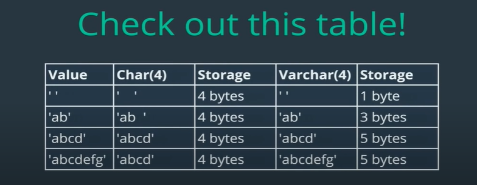
in last one, there is a mistake, varchar(4) also only takes abcd(in latest version it will give error if we try to insert value that exceeds specified length of char or varchar)

lets create a new db , create table in it with char and varchar and insert data in it:
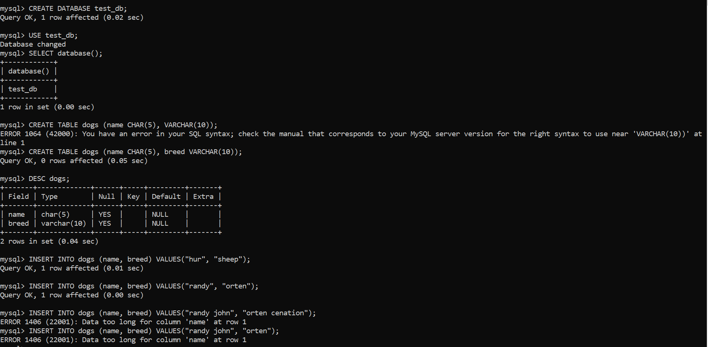

# Numbers

### INT (already learnt) => interger, decimal dont matter

### DECIMAL (decimal number)

Syntax:

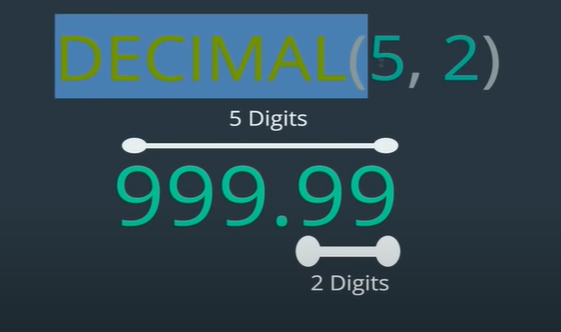
Here it says total 5 digits is allowed among which 2 digits are after point.

It rounds up automatically.

Here you can read about it in mysql docs:
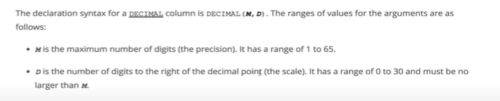

eg:
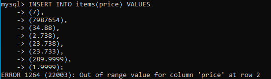
In latest versions, if you try to insert value out of bound it gives error: but in previous old version it is stored as maximum possible value eg: for DECIMAL(5,2), maximum possible value 999.99 is stored in old versions

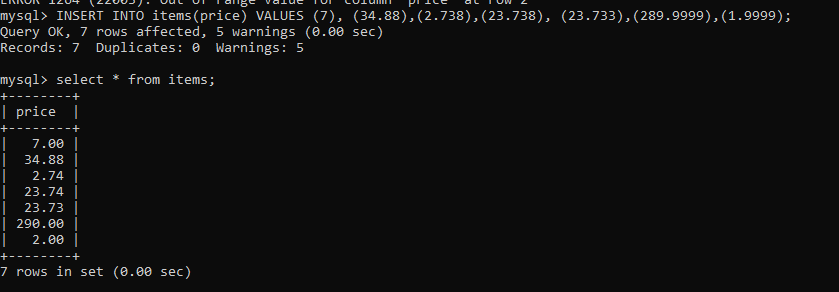
As we can see it rounds up exactly.

### FLOAT AND DOUBLE

how are they different from decimal ?
And which one to use?

if we look at docs we see:
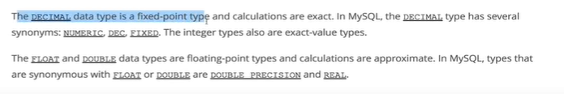
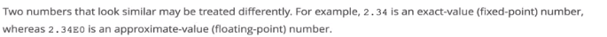

So we can save storage/memory using float or double but we will compromise accuracy and precision:
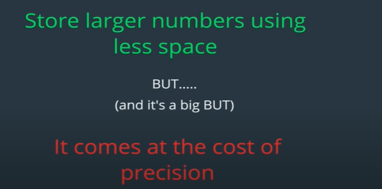

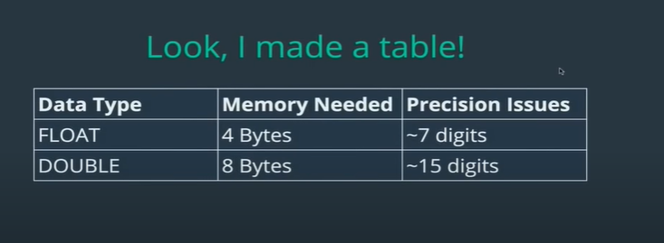
So, float and double loses precision when numbers are larger than 7 digits and 15 digits respectively.

## NOTE: Always use decimal for better precision and accuracy (eg: for data such as price, amount, etc). If you want to save memory, you can choose float or double compromising precision after 7 and 15 digits. Among float or double, double is better as it has higher numerical capacity for precision.

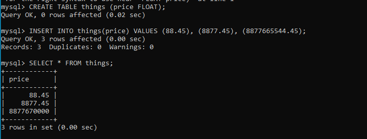
as we can see after upto 7 digits, it is stored correctly rounded up then digits after it are replaced by 0.
Same goes for double after 15 digits.

## Dates and times

Some generally used data types related to dates and times are:

### DATE

Usage : date of birth

### TIME

Usage: Timer

### DATETIME

Usage: create_at, updated_at, commented_at, etc
This is the mostly used one.

lets try it out:

lets first create a table with all these 3 data types:
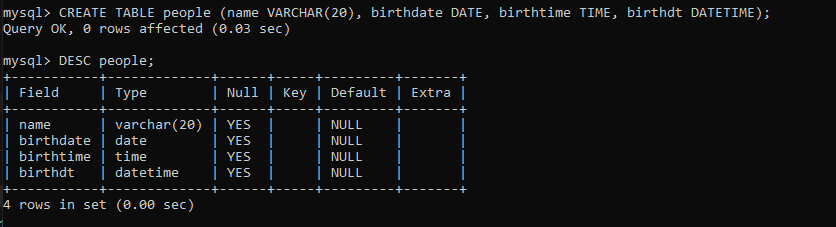

lets insert some data in it:
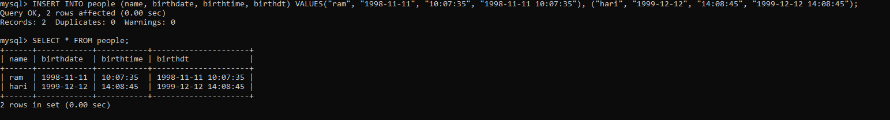

But, usually we dont manually insert/add or update dates and times, we use functions for it.Some of the most use date and time related functions are:

#### CURDATE()

gives current date

#### CURTIME()

gives current time

#### NOW()

gives current datetime

#### TIMESTAMP(date_or_dateTime)

takes date or datetime as arg(ie time is optional), and returns a datetime

eg:
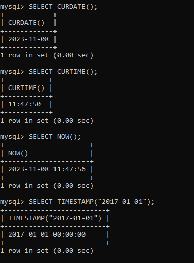

SO WE CAN use them:
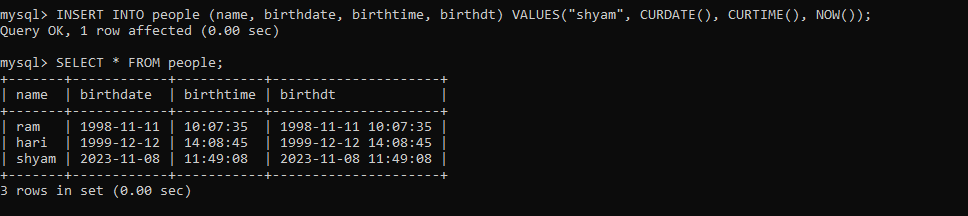

#### Formatting dates

Just like NOW(), CURTIME(), etc there are many functions to play with dates and times such as:
DAY(), DAYNAME(), HOUR() etc .You can read about them in docs but they are not much useful.

The most useful one is DATE_FORMAT(date_or_dateTime, format)
There are specifiers to format date or datetime, you can read of them in docs to use them: Lets see some example:

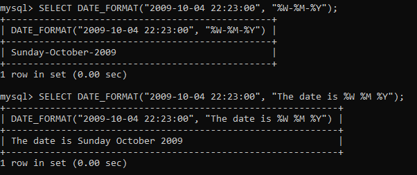
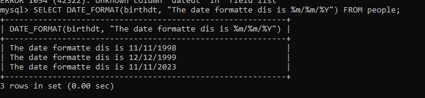
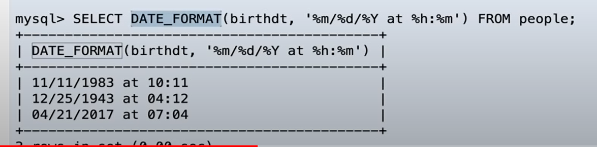

#### DATE MATH/ ARITHMETIC

### DATEDIFF

to find difference between two dates/datetimes
returns number of days

syntax: DATEDIFF(d1, d2),
does d1-d2 and return number of days, where d1,d2 are date or dateTimes.
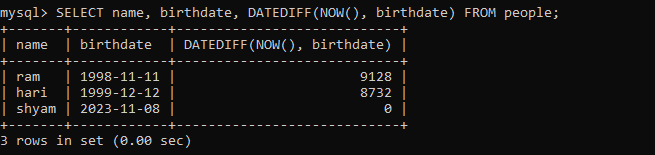

to add and subtract required period in a date/datetime we can use DATE_ADD, DATE_SUB or simply +/-

syntax:
DATE_ADD(d1, INTERVAL period_to_add) or, d1 + INTERVAL period_to_add
DATE_SUB(d1, INTERVAL period_to_substract) or, d1 - INTERVAL period_to_substract

Look at docs for more info.Here are some examples

add 1 month to each birthdt:
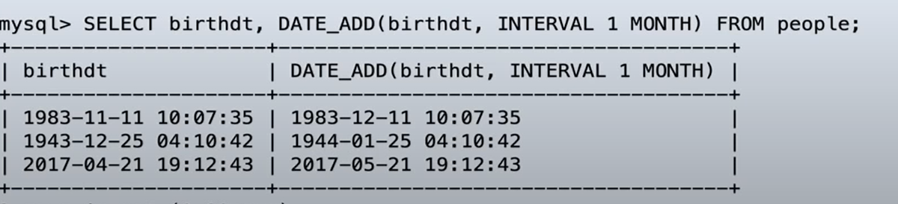
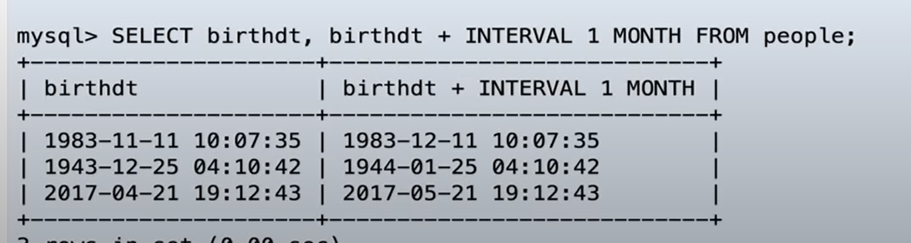
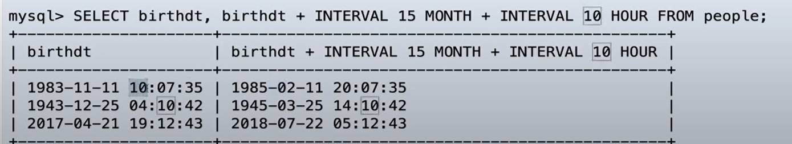

### TIMESTAMP (also a data type)

DATETIME and TIMESTAMP are pretty much similar , both are have date and time and are in same format.

But , Timestamps are usually used as metadata such as created_at, updated_at,etc
Aslo , major difference is range
Range of DATETIME in year=> 1000 - 9999
Range of TIMESTAMP in year=> 1970 -2038

so lets use TIMESTAMP to use as created_at and updated_at:
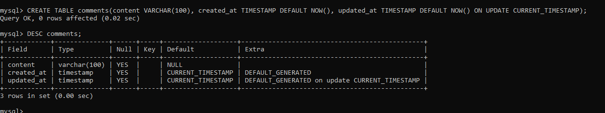

here we used NOW() ie current dateTime as created_at and updated_at default value, but update_at's value will change when that row is updated since ON UPDATE is used to CURRENT_TIMESTAMP(same and can use NOW() also).

lets test this:
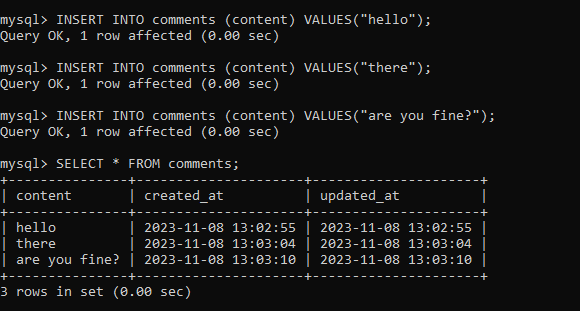

By default current dateTime is used in both created_at, and updated_at as default value.

Now lets see if updated_at value, changes when a row is updated:
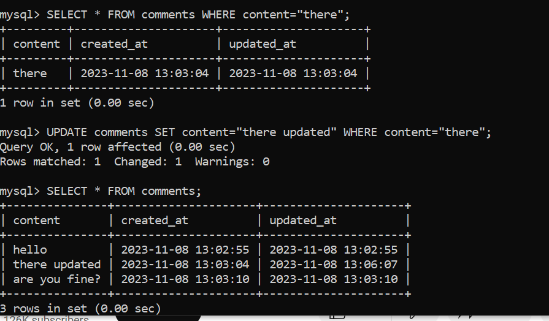
we can see updated_at is changed for updated row.

Sort by latest to oldest updated_at:
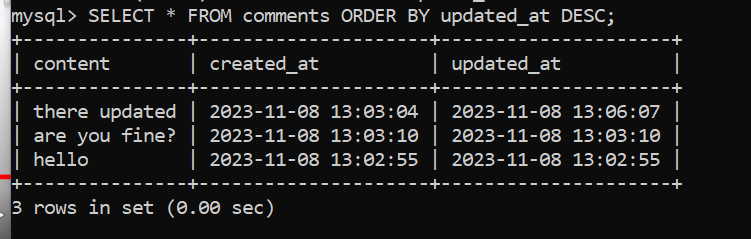
